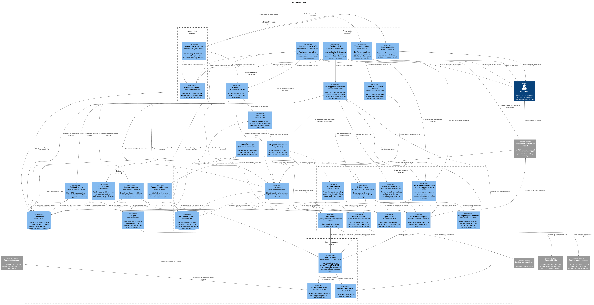
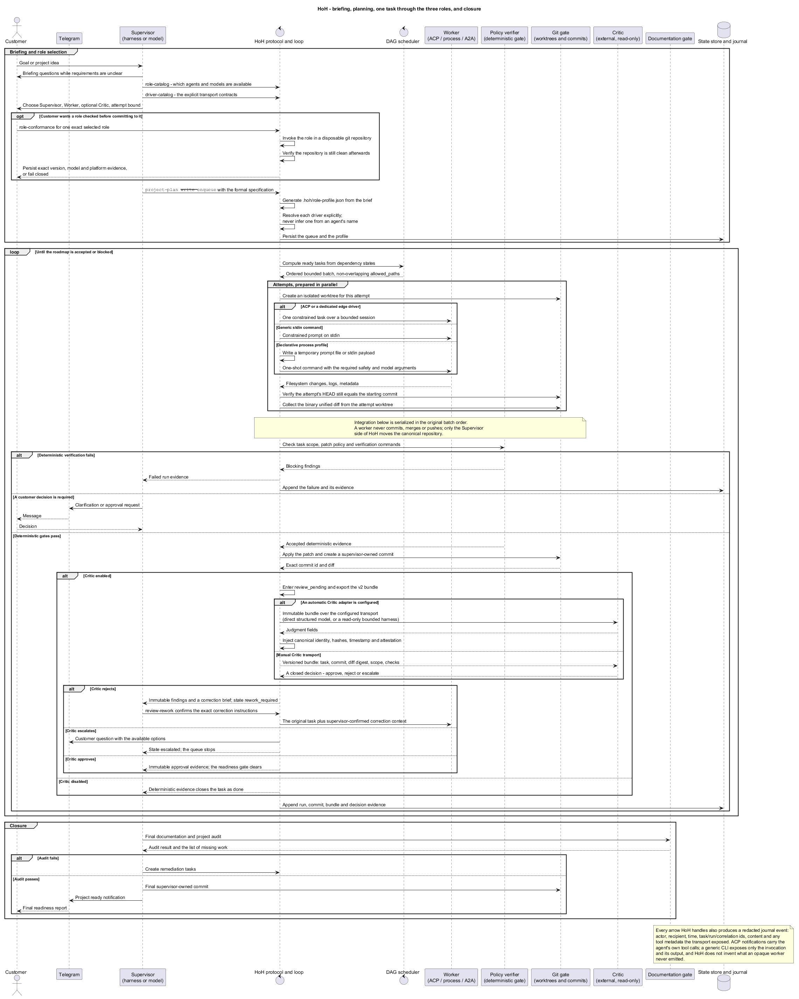
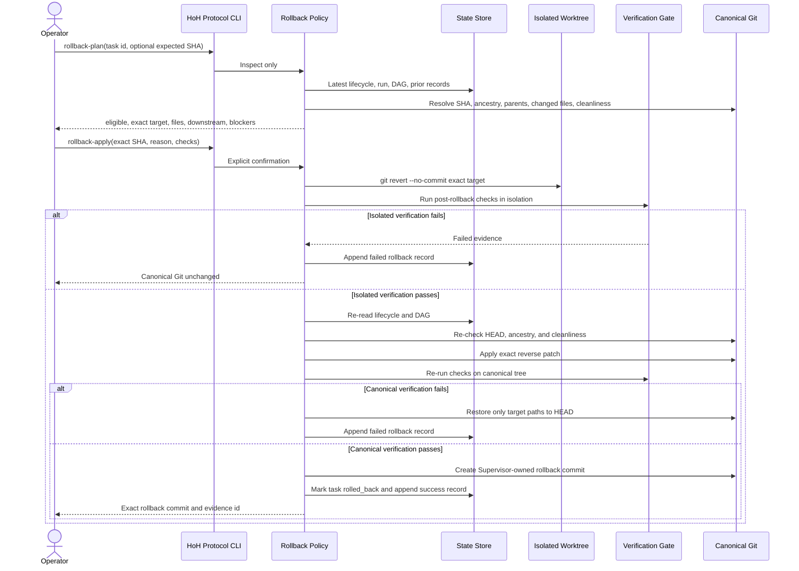
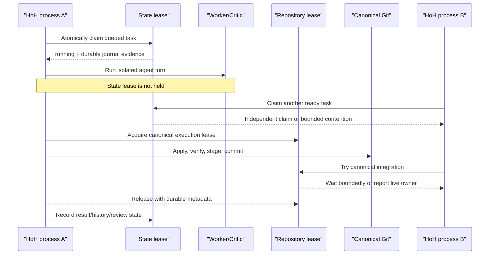

# Architecture Specification

[Русский](architecture.ru.md) · **English**

## Goal

Build a universal harness for LLM coding agents using a "supervisor - worker - optional critic" model.
The worker is treated as low-trust execution capacity. The supervisor owns planning, task slicing,
git operations, commits, rollback decisions, and user communication. The verifier is independent
from the supervisor and validates whether the result satisfies objective acceptance criteria when
the customer enables that third layer. Otherwise deterministic gates return closure authority to
the Supervisor.

This is harness-over-harness rather than a self-directed Ralph loop: the same model does not set
the task, execute it, and approve its own result. Approval is externalized.

## Diagrams

The `.puml` files are the source; the rendered PNGs below are what GitHub shows,
because it does not render PlantUML inline. Re-render with
`java -jar plantuml.jar -DPLANTUML_LIMIT_SIZE=16384 -tpng -o . docs/*.puml`
after editing either source.

**C4 component view** — [source](architecture-c4-component.puml)



**Main sequence** — [source](architecture-sequence.puml)



Every arrow handled by HoH also produces a redacted journal event with actor, recipient, time,
task/run/correlation identifiers, content, and available tool metadata. ACP notifications expose
agent tool calls directly. Generic CLI adapters expose the process invocation and stdout/stderr;
HoH cannot invent private tool calls that an opaque worker does not emit.

The desktop-specific configuration and execution sequence, including explicit Supervisor, Worker,
and Critic selection, is documented in [`gui.md`](gui.md).

## Roles

### User

Provides a vague idea, request, or business desire. The user is not expected to provide complete
requirements in the first message.

### Supervisor

The supervisor is a role, not an embedded provider requirement. It may live outside HoH and use
the protocol boundary, or `project-plan --requirements` may call the configured OpenAI Responses
or DeepSeek Chat Completions adapter. Model output is constrained to project-spec v1 so it cannot
select agents, credentials, role authority, or Git policy.

Responsibilities:

- Ask clarification questions before implementation.
- Each clarification question must include:
  - `реши сам`
  - `свой`
  - concrete options where possible
- Convert answers into a formal technical specification.
- Choose architecture.
- Decompose the project into atomic, easily verifiable work items.
- Define success metrics before implementation.
- Define test, deployment, documentation, and handoff requirements.
- Own all git operations: branch creation, patch application, commits, rollback, merge, and release.
- Run the final project audit before declaring the project ready.
- Ensure Markdown documentation reflects the actual repository state.
- Ensure architecture documentation contains at least a C4 Component diagram and a Sequence diagram.
- Notify the user through Telegram when user action is required and when the project is ready.

### Worker

Local agent such as Codex, Claude Code, Hermes, or another CLI tool.

Responsibilities:

- Receive one atomic task.
- Produce a patch only.
- Avoid direct filesystem writes in the target project.
- Avoid branch, commit, merge, or rollback operations.
- Return enough metadata for traceability.

The worker is not trusted to decide scope, acceptance criteria, architecture, or completion status.
If the worker needs filesystem access, it receives a temporary isolated git worktree instead of the
canonical repository path. HoH collects a patch from that worktree and removes the attempt before
applying accepted changes to the canonical repository.

### Verifier

The verifier is an independent role outside the portable runtime. HoH separates the deterministic
policy verifier used before commit from the external verifier that reviews an exact
supervisor-owned commit through the vendor-neutral JSON protocol.

Responsibilities:

- Review the task, requirements, patch, tests, and resulting repository state.
- Check objective acceptance criteria.
- Check whether metrics were satisfied.
- Optionally run or request additional tests.
- Review final audit evidence when the supervisor claims the project is ready.
- Block handoff if verification is incomplete.
- Return only a closed `approve` or `reject` decision document bound to the bundle SHA-256, reviewed
  commit, and reviewed patch SHA-256.

The verifier should not be the same model instance that created the task. Its protocol grants no
commit or merge authority; importing a rejection records evidence but performs no git mutation.

## Supervisor-facing protocol

HoH is not the supervisor model. It is the deterministic control surface that the external
supervisor uses to run a project through git.

Required supervisor-authored input:

- project spec JSON containing project id, title, goal, customer, business requirements,
  definition of done, and atomic tasks;
- each atomic task containing objective, acceptance criteria, verification commands, allowed paths,
  non-goals, optional dependency IDs, and optional integer priority;
- explicit final audit commands when the project is ready for handoff.

Durable HoH artifacts:

- `docs/hoh/project-brief.md` - Markdown project brief materialized from the spec;
- `docs/hoh/roadmap.md` - Markdown roadmap and task list;
- `tasks/hoh/*.json` - machine-readable atomic worker tasks;
- queue state and run history under the HoH state root;
- audit reports and audit index under the HoH state root;
- immutable review bundles and external verifier decisions under the HoH state root;
- supervisor-owned git commits in the canonical repository.

Supervisor command sequence:

1. `project-plan --spec <project.json> --write --enqueue --json`
2. `supervisor-status --json` to inspect queued work, latest execution evidence, and review gates.
3. `queue-run-loop --config <harness.toml>` to produce deterministic supervisor-owned commits.
4. With `[critic] driver = "claude_code"`, the queue invokes and imports the Critic automatically.
   If the process fails, use `critic-run --config <harness.toml> --json` to retry the existing
   pending bundle without rerunning the Worker.
5. With `[critic] driver = "manual"`, deliver the bundle to any conforming verifier and import its
   answer with `review-import --decision <decision.json> --json`.
6. When review gates are approved, run `queue-run-loop --final-audit --final-check "<command>"` or
   `audit --check "<command>" --json`.
7. `audit-history --json`, `rollback-history --json`, and `review-list --json` to inspect persisted
   handoff and recovery evidence.

If a blocker occurs, HoH sends a notifier message with the task id, reason, and operator options
including `реши сам` and `свой`. The supervisor may then choose `/retry`, `/recover`, `/continue`,
or `/stop` through the same deterministic operator-command layer.

## Verifier and reviewer contract

The verifier boundary receives only explicit evidence:

- task objective, acceptance criteria, verification commands, allowed paths, and non-goals;
- worker patch or collected worktree diff;
- pre-apply policy findings;
- post-apply verification command results;
- changed file list inferred from the patch;
- final audit report before readiness handoff.

The verifier must not infer missing acceptance criteria. If acceptance criteria, checks, docs, or
audit evidence are incomplete, the correct result is a blocker or remediation task rather than
readiness approval.

`workflow-smoke` remains the deterministic daily workflow proof. In `ready` mode it creates a disposable
project spec, materializes supervisor artifacts, enqueues tasks, runs a generic command worker,
commits through the supervisor path, records final audit evidence, and emits a readiness
notification through a stub notifier. In `blocker` mode it intentionally fails the worker and
verifies that queue state and blocker notification evidence are produced without Telegram secrets.

`protocol-conformance` is the external integration proof. It validates distributed schemas and
examples, creates a disposable supervisor-owned commit, exports an integrity-bound review bundle,
observes the pending readiness gate, imports an independent approval, verifies the cleared gate,
and confirms the canonical git repository remains clean.

### Protocol v1 envelope

Machine-facing CLI commands emit a closed top-level envelope when `--json` is present:

- `protocol`: `hoh.protocol`;
- `protocol_version`: `1.0`;
- `message_type`: command-specific stable identifier;
- `ok`: readiness or operation outcome;
- `generated_at_utc`: timezone-aware ISO-8601 timestamp;
- `data`: command-specific object;
- `error`: present only when the operation failed.

This applies to project planning, supervisor status, audit and audit history, review commands, and
all queue inspection, mutation, recovery, and execution commands. Long-running
`queue-run-loop --json` buffers per-run results and emits one valid JSON document when the loop
becomes empty, reaches its limit, is blocked, or completes final audit handoff.

The shipped sources of truth are `schemas/*.schema.json` and `examples/protocol/*.json`. A future
protocol revision must use a new version and schema rather than silently changing v1 fields.

### Review evidence lifecycle

`review-export` accepts a successful run id and resolves its recorded short commit to the exact
40-character commit in the canonical repository. The bundle includes the full binary-capable git
diff, patch digest, changed files, task scope, policy findings, command stdout/stderr, and authority
matrix. HoH hashes the canonical JSON content and stores both the bundle and its append-only index
outside the repository.

`review-import` accepts only closed decision documents. It verifies protocol version, identifiers,
timestamps, bundle digest, commit attestation, patch attestation, finding shape, and decision rules.
A rejection requires at least one finding; an approval cannot contain error or blocker findings.
Unknown fields are rejected, so a verifier cannot smuggle commit, merge, or execution actions into
the decision. Re-importing identical evidence is idempotent; conflicting decisions are rejected.

The `claude_code` adapter runs Claude Code in non-interactive safe mode with tools disabled, session
persistence disabled, and a closed JSON Schema for judgment fields. Patch text, task text, command
output, and repository content are treated as untrusted evidence. The model cannot choose its own
identity, bundle digest, commit, patch digest, or timestamp; HoH copies those fields from the
canonical bundle and role manifest before applying the existing decision validator.

If Claude Code is unavailable, unauthenticated, times out, exits non-zero, or returns invalid
structured output, HoH records the error but keeps the task and bundle in `review_pending`.
`critic-run` is the explicit retry path.

The latest exported bundle per work item controls readiness. Pending and rejected reviews make
`supervisor-status` non-ready. A valid approval clears the review gate. Older review evidence stays
append-only for traceability. The final queue audit/handoff checks the same gate before generating
audit evidence or sending a readiness notification.

## Universal agent model

The harness must distinguish a local coding agent from a raw local model.

### Local agent target

A local agent target is a CLI or service that already knows how to operate as a coding agent. Examples:

- Codex
- Claude Code
- Hermes with a configured local or remote model

The harness sends a formal work item to the agent adapter. The adapter translates the work item into
the agent's input format and expects a structured completion callback containing a patch, branch, or
commit reference depending on trust policy.

A worker agent may run its own internal subagents. HoH does not inspect or trust that internal
topology. From the supervisor boundary, it is still one low-trust worker that must return only the
configured artifact contract. Internal worker subagents must not change HoH ownership of scope,
verification, commits, final audit, or customer handoff.

### Local model endpoint target

A local model endpoint is a raw inference server, for example llama.cpp exposing an OpenAI-compatible
HTTP API. It is not automatically a coding agent.

Raw model endpoints require an executor adapter that supplies:

- repository context selection
- prompt construction
- tool policy
- patch formatting
- timeout policy
- output validation

Without that executor adapter, a raw local model can be used for reasoning or patch drafting only. It
must not receive direct repository privileges.

## Adapter model

The harness must support multiple local execution targets through adapters. An adapter describes:

- agent name
- target type: `local_agent` or `local_model_endpoint`
- command or endpoint to detect
- command to invoke
- input format
- output parsing rules
- timeout and resource policy
- whether the agent can produce patch-only output reliably

The scanner detects installed agents using executable discovery. The portable release checks:

- `codex`
- `claude`
- `hermes`
- `openclaw`
- `aider` when the default declarative profile is present.

Provider-specific behavior must stay behind adapter interfaces.

## Worker adapter contract

Worker execution is selected through `[worker]` config.

Supported worker types:

- `hermes_acp`: runs Hermes through ACP and always requires an isolated `hoh/attempt/*` worktree.
- `command`: runs any configured CLI command in an isolated worktree, sends the task prompt to
  stdin, exposes task metadata through `HOH_*` environment variables, and lets HoH collect the diff.
- `process`: materializes a declarative one-shot CLI profile with stdin/file prompt transport,
  fixed and forbidden arguments, optional model routing, and the same isolated diff contract.
- `claude_code`: runs Claude Code non-interactively with a fixed HoH-owned safety profile.
- `openclaw`: runs one local OpenClaw agent turn with an ephemeral workspace-only config.
- `stub`: deterministic patch worker for tests and demos.

The generic execution path is:

1. Load `[worker]` config.
2. Build a worker adapter through the factory.
3. Create a `WorkerJob` with a concrete `ExecutionTarget`.
4. If the adapter requires isolation, run it inside a temporary git worktree attempt.
5. Reject the completion if the Worker changed the attempt's starting Git commit.
6. Collect or accept a patch through the same supervisor/verifier path.

`worker-run`, `queue-run-next`, and `queue-run-loop` use this generic path. Hermes-specific commands
remain available as compatibility and diagnostics commands.

### Worker capability manifest

`[worker.capabilities]` records the contract between HoH and the configured worker adapter:

- `task_transport`: adapter transport, currently `acp_stdio`, `stdin_prompt`, `profiled_process`, or
  `in_process`.
- `artifact_contract`: artifact HoH will accept, currently `worktree_diff` or `direct_patch`.
- `requires_isolated_worktree`: whether HoH must execute the worker in a disposable git worktree.
- `supports_subagents`: whether the worker may internally delegate to subagents.

The manifest is declarative but enforced where safety matters:

- `doctor` fails when `requires_isolated_worktree` disagrees with the actual adapter behavior.
- `doctor` fails on unsupported artifact contracts.
- `worker-conformance` runs the configured adapter in a disposable git repository and checks the
  manifest, supervisor-owned execution, verification commands, commit creation, and clean canonical
  worktree state.

Example Hermes manifest:

```toml
[worker]
driver = "hermes_acp"
command = "hermes"
args = ["acp"]
timeout_seconds = 300

[worker.capabilities]
task_transport = "acp_stdio"
artifact_contract = "worktree_diff"
requires_isolated_worktree = true
supports_subagents = false
```

Example named Claude Code worker:

```toml
[worker]
driver = "claude_code"
command = "claude"
model = "sonnet"
timeout_seconds = 300
max_budget_usd = 2.0

[worker.capabilities]
task_transport = "stdin_prompt"
artifact_contract = "worktree_diff"
requires_isolated_worktree = true
supports_subagents = false
```

Example named OpenClaw worker:

```toml
[worker]
driver = "openclaw"
command = "openclaw"
model = "openai/gpt-5.6-sol"
thinking = "high"
timeout_seconds = 300
```

`supports_subagents = true` is allowed only as a capability declaration. It does not grant the
worker authority to commit, merge, approve readiness, contact the customer, or mutate state outside
the isolated attempt worktree.

## Command worker adapter

The command adapter is the universal process boundary for local agents that do not expose ACP. It is
intentionally narrow:

- HoH starts the configured process with the isolated attempt worktree as `cwd`.
- HoH writes the full constrained task prompt to stdin.
- HoH sets `HOH_JOB_ID`, `HOH_CALLBACK_TOKEN`, `HOH_REPOSITORY`, `HOH_WORK_ITEM_ID`,
  `HOH_WORK_ITEM_TITLE`, and `HOH_WORK_ITEM_JSON`.
- Exit code `0` means "candidate changes are ready for supervisor collection."
- Non-zero exit, process startup failure, or timeout is a worker blocker.
- The adapter never accepts worker-created final commits as readiness evidence.

This allows Hermes wrappers, custom scripts, and other local agent CLIs to fit the same
supervisor-owned git, verifier, rollback, and commit path.

## Declarative process worker adapter

The process adapter extends the command boundary without product-specific Python. A
`ProcessProfileConfig` supplies a stable profile id, `stdin` or temporary-file prompt placement,
mandatory and forbidden arguments, optional model flag, and version probe. HoH rejects profile or
operator arguments that collide with its prompt/model flags or carry common secret options.

The default Aider declaration is ordinary configuration consumed by this adapter; the executor has
no Aider name check. Therefore another one-shot CLI with the same filesystem-diff lifecycle can be
added through project JSON. The temporary prompt is deleted in `finally`, process telemetry is
bounded, and exit zero grants only candidate-diff collection—not commit or readiness authority.

## Claude Code worker adapter

The named Claude Code adapter uses the official print-mode contract:

- `-p --input-format text --output-format json`;
- `--no-session-persistence --safe-mode --disable-slash-commands --no-chrome`;
- `--permission-mode dontAsk`;
- both the available-tool and pre-approved-tool sets are exactly `Read`, `Edit`, `Write`, `Glob`,
  and `Grep`.

The adapter does not expose Bash, MCP servers, plugins, Chrome, background agents, additional
directories, or session resume. It rejects user arguments that attempt to replace HoH-owned
permission/tool/session flags, including either dangerous permission-bypass flag. The process must
run on a `hoh/attempt/*` branch. JSON result content is not journaled: evidence contains hashes,
sizes, exit status, bounded usage metadata, and classified error kind only.

## OpenClaw worker adapter

OpenClaw's normal agent workspace is persistent configuration and its `agent` command has no
per-turn tool allowlist. HoH therefore never invokes the operator's normal agent configuration
directly. For each attempt it creates a temporary secret-free config with:

- `agents.defaults.workspace = ${OPENCLAW_WORKSPACE_DIR}`, bound to the attempt worktree;
- bootstrap disabled;
- only `read`, `write`, `edit`, and `apply_patch`;
- `tools.fs.workspaceOnly = true`;
- exec mode denied and runtime/web/messaging/elevated tools denied.

The command is `openclaw agent --local --session-key <unique> --message-file <temporary> --model
<explicit> --timeout <bounded> --json`. It never includes `--deliver` or a channel/recipient.
Prompt and config files are deleted after the process exits. Model and plugin network behavior
still follows the explicitly selected OpenClaw installation and route. HoH accepts only the
worktree diff, never OpenClaw's response text or a worker-created commit.

The OpenClaw config is based on the official [agent CLI](https://docs.openclaw.ai/cli/agent),
[workspace](https://docs.openclaw.ai/agent-workspace), and
[tool-policy](https://docs.openclaw.ai/gateway/config-tools) contracts. Claude invocation follows
the official [CLI reference](https://code.claude.com/docs/en/cli-reference) and
[permission modes](https://code.claude.com/docs/en/permission-modes).

## Per-role MCP policy boundary

ACP session setup is owned by HoH, not by an agent name. Each of the three role configs carries an
independent `mcp` policy containing a permission mode, an ACP `ToolKind` allowlist, and zero or more
MCP servers. The default Supervisor and Critic policies reject every permission request and pass no
servers; the compatibility Worker policy selects `allow_once` only for its configured kinds.

Before `session/new`, HoH resolves stdio commands to absolute paths, checks HTTP/SSE against the
agent's advertised `mcpCapabilities`, validates remote HTTPS, and resolves configured secret
bindings from the process environment. The project representation stores only source environment
names. A redacted copy, never the wire message with resolved values, reaches the event sink.

For `session/request_permission`, a missing or future `toolCall.kind` is normalized to `other`.
HoH selects `allow_once` only when the role policy explicitly allows that category; otherwise it
selects a reject option or cancels the request. `allow_always` is never selected. This is a
protocol-level guard in addition to isolated worktrees, scope validation, and Critic independence.

## Hermes ACP adapter

Hermes ACP is the first concrete local worker transport target.

Verified protocol facts:

- `hermes acp` starts a stdio ACP JSON-RPC server.
- `hermes acp --check` validates ACP availability without starting an interactive worker turn.
- ACP stdio messages are UTF-8 JSON-RPC objects delimited by newlines.
- Hermes writes logs to stderr and reserves stdout for ACP JSON-RPC traffic.

Current integration level:

- HoH can check Hermes ACP availability.
- HoH can build the isolated-worktree worker prompt for a Hermes ACP job.
- HoH has an isolated worktree attempt wrapper for Hermes execution.
- HoH can run a live Hermes ACP smoke task in a temporary repository.
- HoH can run the generic worker conformance suite against Hermes through `[worker] driver =
  "hermes_acp"`.
- HoH can load one JSON or Markdown task file and run it through the generic worker adapter path
  with `[worker] driver = "hermes_acp"`.
- HoH rejects direct Hermes execution unless the current branch is `hoh/attempt/*`.

Hermes remains a low-trust worker: it may produce candidate artifacts inside an isolated attempt
worktree, but the supervisor owns scope checks, patch collection, patch application to the canonical
repository, tests, verification, rollback, and commits.

HoH persists task queue state and execution history outside the canonical repository. The scheduler
treats tasks as a DAG: unknown dependency IDs, duplicate edges, and cycles are rejected. A queued
task is runnable only after all dependencies reach `done`; among runnable tasks, descending integer
priority wins and insertion order breaks ties. Failed tasks and interrupted running tasks can be
requeued only through explicit operator commands. `queue-run-loop` detects stale `running` tasks
before starting new work and asks the customer/operator how to proceed instead of silently rerunning
them.

`queue-run-loop` builds deterministic bounded batches from dependency-ready tasks. Priority and
enqueue order determine consideration order. `allowed_paths` are exclusive write-resource scopes:
equal or parent/child scopes conflict, and a missing scope is global/exclusive. Only non-conflicting
tasks enter the same batch.

Worker execution overlaps only inside isolated attempt worktrees. Worktree administration is
serialized, while the potentially slow agent turns run concurrently. After every worker in a batch
has returned, the Supervisor integrates results into the canonical repository one at a time in the
original batch order. Patch policy, verification commands, commits, review transitions, queue writes,
and history writes therefore never race.

The configured maximum is `[scheduler].max_parallel_tasks` and `queue-run-loop --parallelism`
provides a one-run override. Required three-head mode and non-isolated adapters are forced to one
task because Critic closure and canonical writes are hard barriers. A blocker prevents another batch
from starting, but all already-running independent tasks are allowed to finish and receive durable
run records. When all queued tasks are waiting on dependencies, the loop returns
`dependency_blocked` with structured blocker statuses.

## Project lifecycle spec

The project lifecycle spec is the durable supervisor output between customer briefing and worker
execution. It is loaded by `project-plan`.

Required project fields:

- `id`
- `title`
- `goal`
- `customer`
- `business_requirements`
- `definition_of_done`
- `tasks`

Optional project fields:

- `non_functional_requirements`
- `documentation_requirements`
- `constraints`
- `open_questions`

Each task in `tasks` uses the same atomic task contract as standalone task files. `project-plan`
materializes:

- `docs/hoh/project-brief.md`
- `docs/hoh/roadmap.md`
- `tasks/hoh/<number>-<task-id>.json`

When `--enqueue` is supplied, the generated task files are added to the persistent queue with their
file paths recorded as task sources. The command validates and materializes explicit supervisor
input; it does not infer missing requirements.

## Task file contract

Task files are the first durable supervisor-worker handoff artifact. They may be JSON for machine
generation or Markdown for manual review.

Required fields:

- `id`
- `title`
- `objective`
- `acceptance_criteria`
- `verification_commands`

Optional fields:

- `allowed_paths`
- `non_goals`

The loader rejects missing required fields, empty required lists, non-string values, and unsupported
file extensions. Loaded tasks are converted to the same `WorkItem` contract used by the supervisor,
verifier, and worker adapters.

## Queue and history store

The queue store is file-based:

- `queue.json` contains the current task list.
- `history.jsonl` contains immutable execution records.
- `operator-events.jsonl` contains immutable operator/customer decisions received through the
  command handler.
- `telegram-offset.json` contains the next Telegram `getUpdates` offset for inbound polling.
- `review-bundles/` contains canonical integrity-bound external review documents.
- `review-bundles.jsonl` indexes exported bundles by run, work item, commit, digest, and path.
- `review-decisions.jsonl` contains immutable validated external verifier decisions.
- `audit-reports/` contains Markdown final audit evidence.
- `audit-reports.jsonl` indexes final audit evidence files, readiness state, finding count, and
  verification command count.
- `audit-history` is a read-only CLI view over `audit-reports.jsonl` and prints the latest report
  path for operator handoff.

Each queue task stores:

- work item fields
- status: `queued`, `running`, `done`, or `failed`
- source task file
- added and updated timestamps
- attempt count
- last commit
- last error

Each history record stores:

- run id
- work item id
- start and finish timestamps
- success flag
- supervisor commit
- pre-apply and post-apply verifier findings
- verification command results
- error, when present

Each operator event stores:

- event id
- created timestamp
- normalized command
- success flag
- human-readable result message
- raw operator text
- task id, when the command targets a task

By default, the state root is outside the canonical repository:

`<repo-parent>/.hoh-state/<repo-name>-<hash>`

This keeps operational queue writes from making the canonical git worktree dirty before the git gate
creates an isolated worker attempt. Users may override the location with `--state-root` when they
want state elsewhere.

Retry and recovery rules:

- `queue-run-next` selects only `queued` tasks.
- `queue-run-loop` repeatedly selects `queued` tasks and stops at the first blocker.
- `failed` tasks stay failed until an operator runs `queue-retry --task-id <id>`.
- `running` tasks stay running until the current process completes or an operator confirms the run
  was interrupted and runs `queue-recover-running --task-id <id>`.
- `queue-stale` reports `running` tasks whose `updated_at_utc` exceeds the configured age threshold.
- before starting queued work, `queue-run-loop` performs the same stale check with a default
  threshold of 60 minutes; `--stale-minutes 0` disables this preflight check.
- when `--final-audit` is enabled and the queue becomes empty, `queue-run-loop` runs the final
  project audit with the provided `--final-check` commands before reporting readiness.
- stale detection is advisory and blocking; it never requeues or reruns work without an explicit
  operator action.
- retry preserves the attempt count and clears the last error.
- interrupted-run recovery preserves the attempt count and records the recovery reason in
  `last_error`.
- neither retry nor recovery changes git history; only accepted supervisor runs create commits.

Operator command rules:

- Commands are handled by a transport-independent deterministic layer.
- Supported commands are `/status`, `/queue`, `/stale`, `/retry <task-id>`,
  `/recover <task-id> [reason]`, `/continue`, and `/stop`.
- `реши сам` is recorded as a supervisor-delegation decision and does not mutate queue state by
  itself.
- `/continue` is an acknowledgement only; execution resumes when `queue-run-loop` is run.
- Every command is appended to `operator-events.jsonl` whether it succeeds or fails.
- Real Telegram polling must authenticate the sender before passing text to this handler.

Blocker notification rules:

- A blocker is a stale `running` preflight finding, worker/adapter exception, or a result rejected
  by verifier/test gates.
- On a stale preflight blocker, `queue-run-loop` stops before starting another run and notifies the
  customer through the configured notifier.
- On a worker/verifier blocker after a run starts, `queue-run-loop` records the run, stops
  execution, and notifies the customer through the configured notifier.
- On final audit success, `queue-run-loop --final-audit` notifies the customer through
  `notify_project_ready` and includes the saved audit evidence path.
- On final audit failure, `queue-run-loop --final-audit` notifies the customer through
  `notify_audit_failed`, includes the saved audit evidence path, prints finding codes, and exits
  non-zero.
- Telegram delivery is enabled only through config and environment variables; default local runs use
  the stub notifier.
- The notification asks how to proceed and always includes `реши сам` and `свой`, plus concrete
  operator choices such as retry or stop.

## Job and callback lifecycle

The supervisor does not rely on the worker deciding when work is acceptable. It only accepts a
completion signal that says the worker has produced an artifact ready for verification.

1. Supervisor creates a `WorkerJob`.
2. Supervisor records a callback token.
3. Adapter dispatches the job to a local agent or model executor.
4. Worker runs synchronously or asynchronously.
5. Adapter sends `WorkerCompletion` with the callback token.
6. Completion may contain a patch, branch, commit reference, or error.
7. Supervisor validates callback token and forwards the artifact to verifier gates.

The portable release implements this lifecycle with callback tokens, persistent queue/history state,
isolated worktree attempts, and synchronous worker adapter execution. Future adapters can replace
the transport with process stdout, files, localhost HTTP callbacks, or message queues without
changing the supervisor/verifier contract.

## Embedded Python runtime

Production execution must not depend on system Python. The project runtime layout is:

- `runtime/python/` - embedded CPython distribution
- `runtime/python/python.exe` - interpreter used by harness launchers on Windows
- `vendor/wheels/` - pinned wheelhouse for all Python dependencies
- `scripts/bootstrap-runtime.ps1` - installer/validator for offline runtime setup

The harness must validate runtime presence before production execution. Tests may run with the
developer interpreter, but packaged execution should use only the embedded interpreter and vendored
dependencies.

## Worker trust levels

Local models are not equally capable, so worker trust is a project setting rather than a hardcoded
assumption.

**1.0.0 implements `patch_only` only.** `branch_only` and `branch_and_commit` describe the intended
extension and are documented here for that reason; configuring either is refused at config load
time, so no configuration can appear to enable Git authority the worker does not have.

### `patch_only`

Default and safest level.

- worker returns unified diff patches only
- worker cannot create branches
- worker cannot commit
- supervisor owns all git state changes

Use for unknown, small, weak, or unreliable local agents.

### `branch_only`

Intermediate level.

- worker may create an isolated task branch
- worker still must return patch output
- worker cannot commit
- supervisor applies and commits after verification

Use when an agent needs a branch context but should not create durable history.

### `branch_and_commit`

High-trust local model level.

- worker may create branches
- worker may create commits
- supervisor/verifier still inspect the resulting diff and commit metadata
- supervisor owns merge, rollback, release, and final handoff

Use for strong local models or controlled environments. This level still does not allow the worker
to approve its own work.

## Git-only workflow

Verified rule: the worker returns a patch. The supervisor applies it.

1. Supervisor verifies that the canonical repository is clean.
2. Supervisor creates a temporary git worktree and attempt branch outside the canonical worktree.
3. Supervisor sends one atomic task and the attempt path to the worker adapter.
4. Worker writes only inside the attempt worktree.
5. Supervisor stages the attempt worktree index and collects a binary unified diff.
6. Supervisor removes the attempt worktree and deletes the attempt branch.
7. Verifier performs pre-apply policy checks on the collected patch.
8. Supervisor runs `git apply --check` against the canonical repository.
9. Supervisor applies the patch to the canonical repository.
10. Supervisor runs required tests and checks.
11. Verifier performs post-apply checks.
12. Supervisor stages and commits, unless trust policy allowed worker commits and verifier accepted them.
13. Supervisor runs a final project audit before readiness handoff.
14. Supervisor creates the final commit after the audit passes.
15. Supervisor hands off only when documentation, verification, and audit evidence are complete.

Legacy patch-only adapters that already return a unified diff may skip steps 2-6 and enter at the
pre-apply verifier gate.

Earlier trust-policy variants remain available for future adapters:

1. Supervisor creates or selects a branch, unless trust policy delegates branch creation.
2. Supervisor captures clean baseline state.
3. Supervisor sends one atomic task to worker.
4. Worker returns unified diff patch or, at high trust, a verifiable branch/commit reference.
5. Verifier performs pre-apply policy checks.
6. Supervisor runs `git apply --check`.
7. Supervisor applies the patch.
8. Supervisor runs required tests and checks.
9. Verifier performs post-apply checks.
10. Supervisor stages and commits, unless trust policy allowed worker commits and verifier accepted them.
11. Supervisor runs a final project audit before readiness handoff.
12. Supervisor creates the final commit after the audit passes.
13. Supervisor hands off only when documentation, verification, and audit evidence are complete.

If checks fail, the supervisor owns rollback or inspection policy. The worker never approves rollback.

## Production rollback policy

HoH rollback is a Supervisor-controlled compensating commit. It never rewrites history and never
uses `git reset --hard`.

The policy binds a request to the latest successful `RunRecord` for a task and resolves its recorded
commit to a full SHA. Eligibility requires:

- the latest task lifecycle is `done`
- state `last_commit`, latest successful run, and operator `expected_commit` resolve to the same SHA
- the commit is a non-root, non-merge ancestor of `HEAD`
- canonical Git is clean
- no task is running or awaiting review/rework/escalation
- no transitive downstream task is completed or active
- no successful rollback record already targets that commit

Queued downstream tasks do not block execution. After success, their dependency sees
`rolled_back` instead of `done`, so they remain queued and cannot run. Completed downstream work
blocks the plan because silently reverting it would require an explicit cascade policy that HoH does
not infer.



The file-backed portable runtime supports multiple HoH processes through two OS-backed lease
domains. A short state lease serializes queue claims and durable state/evidence writes. A separate
repository execution lease serializes canonical patch, verification, commit, and rollback work.
Rollback still revalidates all preconditions after isolated verification. The kernel lock is the
authority: metadata may become stale after a crash, but recovery never deletes or overrides a live
lock.

## Multi-process single-writer coordination



Lock files are persistent and are never removed as a recovery mechanism. Owner metadata contains
the lease id, PID, host, bounded command label, action, and UTC acquisition time. On process death,
Windows or POSIX releases the kernel lock automatically; `lock-status` then reports the active
metadata as stale, and `lock-recover` can rewrite it only after acquiring the same lock with zero
wait.

State JSON and JSONL files are replaced atomically from a unique temporary file after
`flush`/`fsync`. On POSIX the parent directory is also synced. Readers reject malformed JSON and
JSONL instead of treating it as empty state. Telegram polling and review bundle export use named
operation leases so network polling or bundle generation does not hold the global state lease.

## Canonical operation reconciliation

```mermaid
sequenceDiagram
    participant Q as "Queue startup"
    participant RL as "Repository lease"
    participant OL as "Operation ledger"
    participant Git as "Canonical Git"
    participant ST as "StateStore"
    participant OP as "Operator"

    Q->>RL: Acquire startup reconciliation lease
    Q->>OL: Read and validate record SHA-256
    OL->>Git: Compare baseline HEAD, trailer, parent, scope, and worktree
    OL->>ST: Compare run or rollback identity
    alt Exact commit exists and state is missing
        OL->>ST: Idempotently append exact recorded state
        OL->>OL: Mark state_recorded and complete
    else State already matches
        OL->>OL: Finish ledger only
    else Clean intent or exact uncommitted patch
        OL-->>OP: Report guarded safe_action
    else Dirty, live, corrupted, or contradictory
        OL-->>Q: Block Worker and canonical mutation
        OL-->>OP: Report evidence; never mutate Git automatically
    end
    Q-->>RL: Release
```

Task and rollback operations share the same phase vocabulary: durable intent, patch applied,
verification evidence persisted, commit created, StateStore recorded, and terminal outcome. Commit
messages contain `HoH-Operation: <uuid>`, allowing a crash immediately after `git commit` to be
reconciled without guessing from task titles. Review bundle generation is deterministic and
idempotent; startup repairs a successful `review_pending` run that crashed before bundle attachment.
Imported critic decisions are append-only and their lifecycle application is idempotent, so a
retry after decision persistence never invokes the Critic again.

The ledger does not persist raw candidate patches. It stores the patch digest plus SHA-256/size
evidence for every baseline and expected post-image file. This is sufficient to reject same-path
tampering and to restore exact baseline paths while reducing sensitive-data exposure. Verification
stdout/stderr, findings, rollback reasons, and terminal details are passed through the same
redaction policy as the interaction journal before ledger persistence.

## Final project audit

The supervisor is accountable to the customer for the final state of the project. Before reporting
readiness, the supervisor must audit the whole repository, not only the last task.

Required audit scope:

- all tests, build steps, type checks, linters, and documented manual checks that apply to the project
- README and setup instructions
- architecture documentation in Markdown
- at least two architecture diagrams in Markdown:
  - C4 Component diagram
  - Sequence diagram
- materialized lifecycle artifacts, when present:
  - `docs/hoh/project-brief.md`
  - `docs/hoh/roadmap.md`
  - valid task files under `tasks/hoh/`
- deployment or local run instructions
- configuration and secrets handling documentation
- TODO, FIXME, placeholders, stubs, dead code, unused files, generated trash, and obsolete notes <!-- hoh-audit: ignore-line -->
- unused or unexplained dependencies
- mismatch between documentation and actual behavior
- incomplete acceptance criteria or unresolved verifier findings

### Language analyzer boundary

`llm_harness.language_audit` is an offline, deterministic extension layer. Each registered analyzer
receives the project root, tracked files, and configured entry-point patterns and returns immutable
evidence with an analyzer id, language, status, file count, findings, and detail. Built-in runners
cover Python, JavaScript, and TypeScript; another runner can be registered behind the same
`ANALYZER_RUNNERS` contract without changing the audit report protocol.

Python uses the standard-library AST for unreachable statements and unused private declarations,
plus a module import graph. JavaScript and TypeScript use conservative static import and top-level
reference analysis without downloading or invoking package-manager tooling. Explicit `[audit]`
entry points enable strict reachability for the matching language. Without a matching configured
root, only private orphan source files are considered unused, reducing false positives for library
entry points and framework-discovered modules.

Evidence states are `passed`, `findings`, `unsupported` (no applicable files or unknown analyzer),
and `unavailable` (the runner failed). `fail_on_unavailable = true` converts unavailable required
analysis into a blocking audit finding. Unsupported languages remain visible but are not treated as
proof that those sources were analyzed. The analyzer layer is read-only and never deletes files.

The final audit result must produce a Markdown-ready report containing:

- verified facts
- checks executed and their results
- documentation files reviewed
- diagrams found or missing
- unresolved risks and limitations
- exact remediation tasks if the project is not ready

Readiness is false if the audit finds stale documentation, missing mandatory diagrams, failing tests,
unresolved TODOs that affect product behavior, unused project artifacts without explanation, or
acceptance criteria without evidence.

The final commit is owned by the supervisor. The worker must not create the final commit.

## Metrics

Every work item must define measurable completion criteria before implementation.

Required metrics:

- acceptance criteria count
- required tests count
- changed files count
- forbidden paths touched count
- verifier findings count
- documentation impact status
- deployment impact status

Recommended quality metrics:

- test pass/fail result
- lint/type-check result
- reproducible manual validation steps
- trace ID linking user request, task, patch, verifier report, and commit

No task is complete unless the verifier confirms the defined metrics.

## Telegram integration

Telegram is the customer communication channel for escalation and readiness reporting.

The harness sends a Telegram message when:

- requirements are ambiguous and cannot be safely decided
- credentials or external access are required
- deployment approval is required
- verification fails and user tradeoff is needed
- production-impacting rollback or merge approval is required
- the final audit passes and the project is ready for handoff
- the final audit fails and customer action or decision is required

Telegram is disabled by default. The no-send stub records messages in memory for tests and local
flows. Real delivery uses the Telegram Bot API `sendMessage` method with bot token and chat ID read
from environment variables named by config. Project config must not contain raw Telegram tokens.

Inbound Telegram commands are handled through the same polling path in two CLI modes:

- `telegram-poll` performs one `getUpdates` cycle and exits
- `telegram-watch` repeats polling until interrupted when `--iterations 0`, or exits after a
  positive bounded `--iterations` count

- calls the Telegram Bot API `getUpdates` method
- reads only text `message` updates
- authenticates both `message.from.id` and `message.chat.id` against environment values named in
  config
- forwards authorized text to the deterministic operator command handler
- sends the command result back through `sendMessage`
- stores the next `getUpdates` offset in `telegram-offset.json` under the queue state root
- advances offset for ignored updates so unauthorized or unsupported updates do not block the queue

`telegram-watch` is a thin scheduler-friendly loop around the same deterministic command handler,
not a daemon manager. Operators can run it manually, from a scheduler, or from a service wrapper.
Webhook mode is intentionally outside the current portable scope.

## Model configuration

Supervisor and verifier model providers must be configurable independently. Users may choose any
combination, for example ChatGPT as supervisor and DeepSeek as verifier.

`PolicyVerifier` always runs first. If `verifier_model` is not `stub`, a semantic verifier then
receives the bounded task, patch, and deterministic command evidence. It may return `pass`, `fail`,
or `escalate`; it has no file, tool, staging, commit, merge, or task-close capability. Only `pass`
allows the Supervisor to proceed to staging and commit. Invalid output or a provider failure is
fail-closed and the applied patch is reverted.

The provider boundary normalizes vendor responses into structured JSON plus redacted evidence:
provider/model, endpoint path, provider request id, attempts, latency, token counts, and request/
response SHA-256. Prompts and credentials are not journal evidence. HTTPS is mandatory except for
loopback fake servers. Retry is bounded to timeout, 408, 429, and 5xx classes.

## Module map

Every module lives directly in `src/llm_harness/`. There is no `gui/` or `adapters/` package
subdirectory.

| Area | Modules |
|---|---|
| Desktop UI | `gui.py`, `gui_services.py`, `gui_display.py` |
| Remote protocol and authentication | `a2a.py`, `a2a_adapters.py`, `a2a_push.py`, `agent_auth.py`, `oauth.py`, `oauth_store.py` |
| Role and driver adapters | `acp.py`, `acp_agents.py`, `acp_registry.py`, `driver_registry.py`, `worker_adapters.py`, `supervisor_adapters.py`, `critic_adapters.py`, `provider_workers.py`, `command_worker.py`, `process_worker.py`, `hermes.py`, `workers.py` |
| Queue, state and scheduling | `state.py`, `lifecycle.py`, `tasks.py`, `jobs.py`, `coordination.py`, `scheduler_service.py`, `background_scheduler.py`, `workspace.py` |
| Patch gate and safe Git integration | `verifier.py`, `command_policy.py`, `git_ops.py`, `attempts.py`, `supervisor.py`, `supervisor_chat.py`, `rollback.py`, `review_protocol.py`, `critic_runtime.py`, `operations.py`, `trust.py` |
| Evidence and reporting | `journal.py`, `metrics.py`, `audit.py`, `language_audit.py`, `agent_matrix.py`, `conformance.py`, `protocol_conformance.py`, `three_head_conformance.py` |
| Distribution and updates | `runtime.py`, `portable_package.py`, `updater.py`, `signed_catalog.py`, `agent_installation.py` |
| Entry points | `cli.py`, `__main__.py`, `headless_server.py`, `frozen_entry.py` |

`scripts/` holds packaging, runtime, update-catalog and service wrappers. `schemas/`, `catalogs/`
and `tests/` hold contracts, ACP Registry data and evidence.
