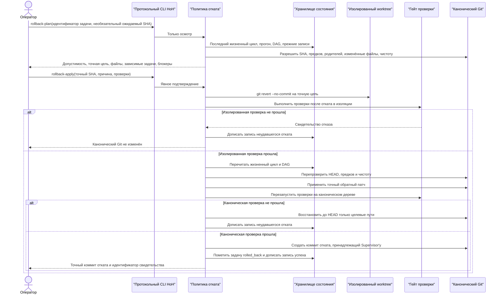
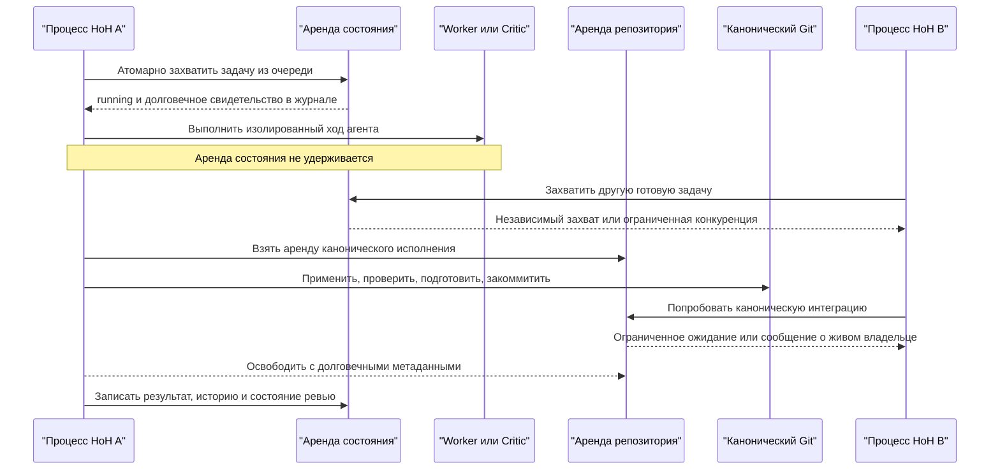

# Спецификация архитектуры

[English](architecture.md) · **Русский**

## Цель

Построить универсальный harness для LLM coding-агентов по модели «supervisor — worker —
необязательный critic». Worker считается недоверенной исполняющей мощностью. Supervisor владеет
планированием, нарезкой задач, операциями с git, коммитами, решениями об откате и коммуникацией с
пользователем. Verifier независим от supervisor и проверяет, удовлетворяет ли результат объективным
критериям приёмки, когда заказчик включает этот третий слой. Иначе детерминированные гейты
возвращают право закрытия задачи Supervisor'у.

Это harness-over-harness, а не самонаправленный Ralph-цикл: одна и та же модель не ставит задачу,
исполняет её и одобряет собственный результат. Одобрение вынесено наружу.

## Диаграммы

Файлы `.puml` — исходники; ниже отрендеренные PNG, которые и показывает GitHub, потому что инлайн
PlantUML он не рендерит. После правки любого исходника перерисуйте:
`java -jar plantuml.jar -DPLANTUML_LIMIT_SIZE=16384 -tpng -o . docs/*.puml`.

**C4-компоненты** — [исходник](architecture-c4-component.puml)


**Основная последовательность** — [исходник](architecture-sequence.puml)


Каждая стрелка, которую обрабатывает HoH, порождает и событие журнала с вырезанными секретами: кто
действует, кто получатель, время, идентификаторы задачи, прогона и корреляции, содержимое и доступные
метаданные инструментов. Уведомления ACP раскрывают вызовы инструментов агента напрямую. Обычные
CLI-адаптеры раскрывают вызов процесса и его stdout/stderr; HoH не может выдумать приватные вызовы
инструментов, которых непрозрачный worker не выдаёт.

Специфичная для десктопа последовательность настройки и исполнения, включая явный выбор Supervisor,
Worker и Critic, описана в [`gui.ru.md`](gui.ru.md).

## Роли

### Пользователь

Даёт расплывчатую идею, запрос или бизнес-желание. От пользователя не ждут полных требований в первом
же сообщении.

### Supervisor

Supervisor — это роль, а не требование о встроенном провайдере. Он может жить вне HoH и пользоваться
границей протокола, либо `project-plan --requirements` может вызвать настроенный адаптер OpenAI
Responses или DeepSeek Chat Completions. Вывод модели ограничен схемой project-spec v1, поэтому он не
может выбирать агентов, учётные данные, полномочия ролей и политику Git.

Обязанности:

- Задавать уточняющие вопросы до реализации.
- Каждый уточняющий вопрос обязан включать:
  - `реши сам`
  - `свой`
  - конкретные варианты, где это возможно
- Превращать ответы в формальное техническое задание.
- Выбирать архитектуру.
- Раскладывать проект на атомарные, легко проверяемые рабочие элементы.
- Определять метрики успеха до реализации.
- Определять требования к тестам, развёртыванию, документации и передаче.
- Владеть всеми операциями git: созданием веток, применением патчей, коммитами, откатом, merge и
  релизом.
- Проводить финальный аудит проекта до объявления его готовым.
- Следить, чтобы Markdown-документация отражала фактическое состояние репозитория.
- Следить, чтобы архитектурная документация содержала как минимум диаграмму компонентов C4 и
  диаграмму последовательности.
- Уведомлять пользователя через Telegram, когда требуется его действие и когда проект готов.

### Worker

Локальный агент вроде Codex, Claude Code, Hermes или другого CLI-инструмента.

Обязанности:

- Получить одну атомарную задачу.
- Выдать только патч.
- Не писать напрямую в файловую систему целевого проекта.
- Не выполнять операции ветвления, коммита, merge и отката.
- Вернуть достаточно метаданных для прослеживаемости.

Worker'у не доверяют решать вопросы области, критериев приёмки, архитектуры и статуса завершения.
Если worker'у нужен доступ к файловой системе, он получает временный изолированный git worktree
вместо пути канонического репозитория. HoH собирает из этого worktree патч и удаляет попытку до того,
как применить принятые изменения к каноническому репозиторию.

### Verifier

Verifier — независимая роль вне переносимого рантайма. HoH разделяет детерминированный политический
верификатор, работающий до коммита, и внешнего верификатора, который ревьюит точный коммит,
принадлежащий supervisor'у, через вендоронезависимый JSON-протокол.

Обязанности:

- Изучить задачу, требования, патч, тесты и получившееся состояние репозитория.
- Проверить объективные критерии приёмки.
- Проверить, выполнены ли метрики.
- По желанию запустить или запросить дополнительные тесты.
- Изучить свидетельства финального аудита, когда supervisor заявляет о готовности проекта.
- Заблокировать передачу, если проверка неполна.
- Вернуть только закрытый документ решения `approve` или `reject`, привязанный к SHA-256 бандла,
  отревьюенному коммиту и SHA-256 отревьюенного патча.

Verifier не должен быть тем же экземпляром модели, который создал задачу. Его протокол не даёт
полномочий на коммит и merge; импорт отклонения записывает свидетельство, но не меняет git.

## Протокол, обращённый к Supervisor

HoH — не модель supervisor'а. Это детерминированная управляющая поверхность, которую внешний
supervisor использует, чтобы провести проект через git.

Обязательный ввод, создаваемый supervisor'ом:

- JSON спецификации проекта с идентификатором проекта, заголовком, целью, заказчиком,
  бизнес-требованиями, определением готовности и атомарными задачами;
- каждая атомарная задача с целью, критериями приёмки, проверочными командами, разрешёнными путями,
  не-целями, необязательными идентификаторами зависимостей и необязательным целым приоритетом;
- явные команды финального аудита, когда проект готов к передаче.

Долговечные артефакты HoH:

- `docs/hoh/project-brief.md` — Markdown-бриф проекта, материализованный из спецификации;
- `docs/hoh/roadmap.md` — Markdown-дорожная карта и список задач;
- `tasks/hoh/*.json` — машиночитаемые атомарные задачи worker'а;
- состояние очереди и история прогонов под корнем состояния HoH;
- отчёты аудита и их индекс под корнем состояния HoH;
- неизменяемые review-бандлы и решения внешнего верификатора под корнем состояния HoH;
- коммиты git, принадлежащие supervisor'у, в каноническом репозитории.

Последовательность команд supervisor'а:

1. `project-plan --spec <project.json> --write --enqueue --json`
2. `supervisor-status --json`, чтобы изучить поставленную работу, свежие свидетельства исполнения и
   гейты ревью.
3. `queue-run-loop --config <harness.toml>`, чтобы получить детерминированные коммиты, принадлежащие
   supervisor'у.
4. При `[critic] driver = "claude_code"` очередь вызывает и импортирует Critic автоматически. Если
   процесс отказал, используйте `critic-run --config <harness.toml> --json`, чтобы повторить попытку
   на существующем ожидающем бандле, не перезапуская Worker.
5. При `[critic] driver = "manual"` доставьте бандл любому соответствующему верификатору и
   импортируйте его ответ командой `review-import --decision <decision.json> --json`.
6. Когда гейты ревью одобрены, запустите
   `queue-run-loop --final-audit --final-check "<команда>"` или `audit --check "<команда>" --json`.
7. `audit-history --json`, `rollback-history --json` и `review-list --json`, чтобы изучить
   сохранённые свидетельства передачи и восстановления.

Если возникает блокер, HoH отправляет через уведомитель сообщение с идентификатором задачи, причиной и
операторскими вариантами, включая «реши сам» и «свой». Supervisor затем может выбрать `/retry`,
`/recover`, `/continue` или `/stop` через тот же детерминированный слой операторских команд.

## Контракт верификатора и ревьюера

Граница верификатора получает только явные свидетельства:

- цель задачи, критерии приёмки, проверочные команды, разрешённые пути и не-цели;
- патч worker'а или собранный diff worktree;
- находки политики до применения;
- результаты проверочных команд после применения;
- список изменённых файлов, выведенный из патча;
- отчёт финального аудита до передачи готовности.

Верификатор не должен домысливать отсутствующие критерии приёмки. Если критерии приёмки, проверки,
документация или свидетельства аудита неполны, правильный результат — блокер или задача на
исправление, а не одобрение готовности.

`workflow-smoke` остаётся детерминированным доказательством ежедневного процесса. В режиме `ready` он
создаёт одноразовую спецификацию проекта, материализует артефакты supervisor'а, ставит задачи в
очередь, запускает обычный command-worker, коммитит по пути supervisor'а, записывает свидетельства
финального аудита и выдаёт уведомление о готовности через уведомитель-заглушку. В режиме `blocker` он
намеренно роняет worker'а и проверяет, что состояние очереди и свидетельства уведомления о блокере
создаются без секретов Telegram.

`protocol-conformance` — доказательство внешней интеграции. Он проверяет поставляемые схемы и
примеры, создаёт одноразовый коммит, принадлежащий supervisor'у, экспортирует связанный целостностью
review-бандл, наблюдает ожидающий гейт готовности, импортирует независимое одобрение, проверяет
снятый гейт и подтверждает, что канонический git-репозиторий остался чистым.

### Конверт протокола v1

Машинно-ориентированные команды CLI выдают закрытый конверт верхнего уровня, когда указан `--json`:

- `protocol`: `hoh.protocol`;
- `protocol_version`: `1.0`;
- `message_type`: стабильный идентификатор, специфичный для команды;
- `ok`: готовность или исход операции;
- `generated_at_utc`: метка времени ISO-8601 с часовым поясом;
- `data`: объект, специфичный для команды;
- `error`: присутствует только при отказе операции.

Это относится к планированию проекта, статусу supervisor'а, аудиту и его истории, командам ревью и ко
всем командам осмотра, изменения, восстановления и исполнения очереди. Долгоиграющий
`queue-run-loop --json` буферизует результаты по прогонам и выдаёт один валидный JSON-документ, когда
цикл опустошается, достигает предела, блокируется или завершает передачу по финальному аудиту.

Поставляемые источники истины — `schemas/*.schema.json` и `examples/protocol/*.json`. Будущая
ревизия протокола обязана использовать новую версию и схему, а не менять поля v1 молча.

### Жизненный цикл свидетельств ревью

`review-export` принимает идентификатор успешного прогона и разрешает записанный короткий коммит до
точного 40-символьного коммита в каноническом репозитории. Бандл включает полный git diff,
способный нести двоичные данные, дайджест патча, изменённые файлы, область задачи, находки политики,
stdout/stderr команд и матрицу полномочий. HoH хеширует каноническое содержимое JSON и хранит и сам
бандл, и его дописываемый индекс вне репозитория.

`review-import` принимает только закрытые документы решения. Он проверяет версию протокола,
идентификаторы, метки времени, дайджест бандла, аттестацию коммита, аттестацию патча, форму находок и
правила решения. Отклонение требует хотя бы одной находки; одобрение не может содержать находок
уровня error или blocker. Неизвестные поля отклоняются, поэтому верификатор не может протащить в
решение действия коммита, merge или исполнения. Повторный импорт идентичного свидетельства
идемпотентен; конфликтующие решения отклоняются.

Адаптер `claude_code` запускает Claude Code в неинтерактивном безопасном режиме с отключёнными
инструментами, отключённым сохранением сессии и закрытой JSON-схемой для полей решения. Текст патча,
текст задачи, вывод команд и содержимое репозитория считаются недоверенными свидетельствами. Модель
не может выбрать себе личность, дайджест бандла, коммит, дайджест патча и метку времени; HoH копирует
эти поля из канонического бандла и манифеста роли, прежде чем применить существующий валидатор
решения.

Если Claude Code недоступен, не аутентифицирован, вышел по таймауту, завершился ненулевым кодом или
вернул некорректный структурированный вывод, HoH записывает ошибку, но оставляет задачу и бандл в
`review_pending`. `critic-run` — явный путь повтора.

Готовностью управляет последний экспортированный бандл по каждому рабочему элементу. Ожидающие и
отклонённые ревью делают `supervisor-status` неготовым. Действительное одобрение снимает гейт ревью.
Более старые свидетельства ревью остаются дописываемыми ради прослеживаемости. Финальный аудит и
передача из очереди проверяют тот же гейт до порождения свидетельств аудита и отправки уведомления о
готовности.

## Универсальная модель агента

Harness обязан различать локального coding-агента и сырую локальную модель.

### Цель «локальный агент»

Цель типа «локальный агент» — CLI или сервис, который уже умеет работать как coding-агент. Примеры:

- Codex
- Claude Code
- Hermes с настроенной локальной или удалённой моделью

Harness отправляет формальный рабочий элемент адаптеру агента. Адаптер переводит рабочий элемент во
входной формат агента и ожидает структурированный обратный вызов о завершении с патчем, ссылкой на
ветку или коммит — в зависимости от политики доверия.

Worker-агент вправе запускать собственных внутренних субагентов. HoH не изучает и не доверяет этой
внутренней топологии. С границы supervisor'а это по-прежнему один недоверенный worker, обязанный
вернуть только настроенный контракт артефакта. Внутренние субагенты worker'а не должны менять того,
что HoH владеет областью, проверкой, коммитами, финальным аудитом и передачей заказчику.

### Цель «локальный эндпоинт модели»

Локальный эндпоинт модели — сырой сервер инференса, например llama.cpp, выставляющий
OpenAI-совместимый HTTP API. Он не является coding-агентом автоматически.

Сырым эндпоинтам моделей нужен адаптер-исполнитель, который обеспечивает:

- выбор контекста репозитория
- построение промпта
- политику инструментов
- форматирование патча
- политику таймаутов
- проверку вывода

Без такого адаптера-исполнителя сырую локальную модель можно использовать только для рассуждения или
черновика патча. Прямые привилегии в репозитории ей давать нельзя.

## Модель адаптеров

Harness обязан поддерживать несколько локальных целей исполнения через адаптеры. Адаптер описывает:

- имя агента
- тип цели: `local_agent` или `local_model_endpoint`
- команду или эндпоинт для обнаружения
- команду для вызова
- входной формат
- правила разбора вывода
- политику таймаутов и ресурсов
- умеет ли агент надёжно выдавать вывод в виде только патча

Сканер обнаруживает установленных агентов поиском исполняемых файлов. Переносимый релиз проверяет:

- `codex`
- `claude`
- `hermes`
- `openclaw`
- `aider`, когда присутствует декларативный профиль по умолчанию.

Поведение, специфичное для провайдера, обязано оставаться за интерфейсами адаптеров.

## Контракт адаптера Worker

Исполнение worker'а выбирается через конфигурацию `[worker]`.

Поддерживаемые типы worker'а:

- `hermes_acp`: запускает Hermes через ACP и всегда требует изолированного worktree `hoh/attempt/*`.
- `command`: запускает любую настроенную CLI-команду в изолированном worktree, отправляет промпт
  задачи в stdin, раскрывает метаданные задачи через переменные окружения `HOH_*` и позволяет HoH
  собрать diff.
- `process`: материализует декларативный одноразовый профиль CLI с передачей промпта через stdin или
  файл, фиксированными и запрещёнными аргументами, необязательной маршрутизацией модели и тем же
  контрактом изолированного diff.
- `claude_code`: запускает Claude Code неинтерактивно с фиксированным профилем безопасности, которым
  владеет HoH.
- `openclaw`: выполняет один ход локального агента OpenClaw с эфемерной конфигурацией, ограниченной
  рабочим пространством.
- `stub`: детерминированный worker-патчер для тестов и демонстраций.

Обобщённый путь исполнения:

1. Загрузить конфигурацию `[worker]`.
2. Построить адаптер worker'а через фабрику.
3. Создать `WorkerJob` с конкретной `ExecutionTarget`.
4. Если адаптеру нужна изоляция, выполнить его внутри временной попытки git worktree.
5. Отклонить завершение, если Worker изменил исходный коммит Git у попытки.
6. Собрать или принять патч тем же путём через supervisor и verifier.

`worker-run`, `queue-run-next` и `queue-run-loop` используют этот обобщённый путь. Специфичные для
Hermes команды остаются доступны как команды совместимости и диагностики.

### Манифест возможностей worker'а

`[worker.capabilities]` фиксирует контракт между HoH и настроенным адаптером worker'а:

- `task_transport`: транспорт адаптера, сейчас `acp_stdio`, `stdin_prompt`, `profiled_process` или
  `in_process`.
- `artifact_contract`: артефакт, который HoH примет, сейчас `worktree_diff` или `direct_patch`.
- `requires_isolated_worktree`: обязан ли HoH исполнять worker'а в одноразовом git worktree.
- `supports_subagents`: вправе ли worker внутренне делегировать субагентам.

Манифест декларативен, но принуждается там, где важна безопасность:

- `doctor` падает, когда `requires_isolated_worktree` расходится с реальным поведением адаптера.
- `doctor` падает на неподдерживаемых контрактах артефакта.
- `worker-conformance` запускает настроенный адаптер в одноразовом git-репозитории и проверяет
  манифест, исполнение под управлением supervisor'а, проверочные команды, создание коммита и чистое
  каноническое состояние worktree.

Пример манифеста Hermes:

```toml
[worker]
driver = "hermes_acp"
command = "hermes"
args = ["acp"]
timeout_seconds = 300

[worker.capabilities]
task_transport = "acp_stdio"
artifact_contract = "worktree_diff"
requires_isolated_worktree = true
supports_subagents = false
```

Пример именованного worker'а Claude Code:

```toml
[worker]
driver = "claude_code"
command = "claude"
model = "sonnet"
timeout_seconds = 300
max_budget_usd = 2.0

[worker.capabilities]
task_transport = "stdin_prompt"
artifact_contract = "worktree_diff"
requires_isolated_worktree = true
supports_subagents = false
```

Пример именованного worker'а OpenClaw:

```toml
[worker]
driver = "openclaw"
command = "openclaw"
model = "openai/gpt-5.6-sol"
thinking = "high"
timeout_seconds = 300
```

`supports_subagents = true` допустим только как декларация возможности. Он не даёт worker'у права
коммитить, мержить, одобрять готовность, обращаться к заказчику и менять состояние вне изолированного
worktree попытки.

## Адаптер command-worker'а

Command-адаптер — универсальная граница процесса для локальных агентов, не выставляющих ACP. Он
намеренно узок:

- HoH запускает настроенный процесс, делая изолированный worktree попытки рабочим каталогом.
- HoH пишет полный ограниченный промпт задачи в stdin.
- HoH задаёт `HOH_JOB_ID`, `HOH_CALLBACK_TOKEN`, `HOH_REPOSITORY`, `HOH_WORK_ITEM_ID`,
  `HOH_WORK_ITEM_TITLE` и `HOH_WORK_ITEM_JSON`.
- Код выхода `0` означает «изменения-кандидаты готовы к сбору supervisor'ом».
- Ненулевой код выхода, отказ запуска процесса или таймаут — блокер worker'а.
- Адаптер никогда не принимает созданные worker'ом финальные коммиты как свидетельство готовности.

Это позволяет обёрткам над Hermes, собственным скриптам и другим CLI локальных агентов вписаться в
тот же путь git, верификатора, отката и коммита под управлением supervisor'а.

## Декларативный process-адаптер worker'а

Process-адаптер расширяет command-границу без Python-кода под конкретный продукт. `ProcessProfileConfig`
задаёт стабильный идентификатор профиля, размещение промпта в `stdin` или временном файле,
обязательные и запрещённые аргументы, необязательный флаг модели и пробу версии. HoH отклоняет
аргументы профиля и оператора, которые сталкиваются с его собственными флагами промпта и модели или
несут распространённые опции секретов.

Декларация Aider по умолчанию — обычная конфигурация, которую потребляет этот адаптер; в исполнителе
нет проверки на имя Aider. Поэтому другой одноразовый CLI с тем же жизненным циклом «правки в
файловой системе → diff» добавляется через JSON проекта. Временный промпт удаляется в блоке
`finally`, телеметрия процесса ограничена, а нулевой код выхода даёт лишь право собрать
diff-кандидат — но не полномочия коммита и готовности.

## Адаптер worker'а Claude Code

Именованный адаптер Claude Code использует официальный контракт режима print:

- `-p --input-format text --output-format json`;
- `--no-session-persistence --safe-mode --disable-slash-commands --no-chrome`;
- `--permission-mode dontAsk`;
- и набор доступных инструментов, и набор предварительно одобренных — ровно `Read`, `Edit`, `Write`,
  `Glob` и `Grep`.

Адаптер не даёт доступа к Bash, MCP-серверам, плагинам, Chrome, фоновым агентам, дополнительным
каталогам и возобновлению сессии. Он отклоняет пользовательские аргументы, пытающиеся заменить
принадлежащие HoH флаги разрешений, инструментов и сессии, включая оба опасных флага обхода
разрешений. Процесс обязан выполняться на ветке `hoh/attempt/*`. Содержимое JSON-результата в журнал
не попадает: свидетельство содержит только хеши, размеры, статус выхода, ограниченные метаданные
использования и классифицированный вид ошибки.

## Адаптер worker'а OpenClaw

Обычное рабочее пространство агента OpenClaw — постоянная конфигурация, а у его команды `agent` нет
разрешительного списка инструментов на один ход. Поэтому HoH никогда не вызывает обычную конфигурацию
агента у оператора напрямую. Для каждой попытки он создаёт временную конфигурацию без секретов, в
которой:

- `agents.defaults.workspace = ${OPENCLAW_WORKSPACE_DIR}`, привязанное к worktree попытки;
- bootstrap отключён;
- только `read`, `write`, `edit` и `apply_patch`;
- `tools.fs.workspaceOnly = true`;
- режим exec запрещён, а инструменты рантайма, веба, обмена сообщениями и привилегированные —
  запрещены.

Команда выглядит как `openclaw agent --local --session-key <уникальный> --message-file <временный>
--model <явная> --timeout <ограниченный> --json`. Она никогда не включает `--deliver`, канал или
получателя. Файлы промпта и конфигурации удаляются после завершения процесса. Сетевое поведение
модели и плагинов по-прежнему определяется явно выбранной установкой OpenClaw и маршрутом. HoH
принимает только diff worktree — никогда текст ответа OpenClaw и никогда созданный worker'ом коммит.

Конфигурация OpenClaw основана на официальных контрактах
[agent CLI](https://docs.openclaw.ai/cli/agent),
[рабочего пространства](https://docs.openclaw.ai/agent-workspace) и
[политики инструментов](https://docs.openclaw.ai/gateway/config-tools). Вызов Claude следует
официальному [справочнику CLI](https://code.claude.com/docs/en/cli-reference) и
[режимам разрешений](https://code.claude.com/docs/en/permission-modes).

## Граница политики MCP по ролям

Настройкой ACP-сессии владеет HoH, а не имя агента. Каждая из трёх ролевых конфигураций несёт
независимую политику `mcp` с режимом разрешений, разрешительным списком `ToolKind` из ACP и нулём или
более MCP-серверов. Политики Supervisor и Critic по умолчанию отклоняют любой запрос разрешения и не
передают серверов; политика Worker для совместимости выбирает `allow_once` только для настроенных ей
категорий.

Перед `session/new` HoH разрешает stdio-команды до абсолютных путей, сверяет HTTP/SSE с объявленными
агентом `mcpCapabilities`, проверяет удалённый HTTPS и разрешает настроенные привязки секретов из
окружения процесса. Представление проекта хранит только имена исходных переменных окружения. В приёмник
событий попадает копия с вырезанными секретами, но никогда не сообщение провода с разрешёнными
значениями.

Для `session/request_permission` отсутствующий или будущий `toolCall.kind` нормализуется в `other`.
HoH выбирает `allow_once` только тогда, когда политика роли явно разрешает эту категорию; иначе он
выбирает вариант отказа или отменяет запрос. `allow_always` не выбирается никогда. Это защита уровня
протокола, дополняющая изолированные worktree, проверку области и независимость Critic.

## Адаптер Hermes ACP

Hermes ACP — первая конкретная цель транспорта локального worker'а.

Проверенные факты протокола:

- `hermes acp` запускает stdio-сервер ACP JSON-RPC.
- `hermes acp --check` проверяет доступность ACP, не начиная интерактивного хода worker'а.
- Сообщения ACP по stdio — объекты JSON-RPC в UTF-8, разделённые переводами строк.
- Hermes пишет логи в stderr и оставляет stdout для трафика ACP JSON-RPC.

Текущий уровень интеграции:

- HoH умеет проверять доступность Hermes ACP.
- HoH умеет строить промпт worker'а для изолированного worktree под задание Hermes ACP.
- У HoH есть обёртка изолированной попытки worktree для исполнения Hermes.
- HoH умеет выполнять живую смоук-задачу Hermes ACP во временном репозитории.
- HoH умеет прогонять обобщённый набор проверок соответствия worker'а против Hermes через
  `[worker] driver = "hermes_acp"`.
- HoH умеет загрузить один файл задачи в JSON или Markdown и выполнить его обобщённым путём адаптера
  worker'а при `[worker] driver = "hermes_acp"`.
- HoH отклоняет прямое исполнение Hermes, если текущая ветка не `hoh/attempt/*`.

Hermes остаётся недоверенным worker'ом: он вправе создавать артефакты-кандидаты внутри изолированного
worktree попытки, но supervisor владеет проверками области, сбором патча, применением патча к
каноническому репозиторию, тестами, верификацией, откатом и коммитами.

HoH хранит состояние очереди задач и историю исполнения вне канонического репозитория. Планировщик
рассматривает задачи как DAG: неизвестные идентификаторы зависимостей, дублирующиеся рёбра и циклы
отклоняются. Задача в очереди становится исполнимой только после того, как все её зависимости дошли до
`done`; среди исполнимых побеждает больший целочисленный приоритет, а равенство разрешается порядком
вставки. Неудавшиеся задачи и прерванные исполняющиеся задачи возвращаются в очередь только явными
операторскими командами. `queue-run-loop` обнаруживает зависшие задачи `running` до начала новой
работы и спрашивает заказчика или оператора, как поступить, вместо молчаливого перезапуска.

`queue-run-loop` строит детерминированные ограниченные пакеты из готовых по зависимостям задач.
Приоритет и порядок постановки определяют порядок рассмотрения. `allowed_paths` — монопольные области
ресурса записи: равные области и области «родитель/потомок» конфликтуют, а отсутствие области
считается глобальной и монопольной. В один пакет попадают только неконфликтующие задачи.

Исполнение worker'ов совмещается только внутри изолированных worktree попыток. Администрирование
worktree сериализовано, а потенциально медленные ходы агентов идут параллельно. После того как все
worker'ы пакета вернулись, Supervisor интегрирует результаты в канонический репозиторий по одному в
исходном порядке пакета. Поэтому политика патча, проверочные команды, коммиты, переходы ревью, записи
очереди и записи истории никогда не гоняются между собой.

Максимум задаётся как `[scheduler].max_parallel_tasks`, а `queue-run-loop --parallelism` даёт
переопределение на один прогон. Обязательный трёхголовый режим и неизолированные адаптеры принудительно
сводятся к одной задаче, потому что закрытие через Critic и канонические записи — жёсткие барьеры.
Блокер не даёт начаться следующему пакету, но всем уже идущим независимым задачам позволено
завершиться и получить долговечные записи прогонов. Когда все задачи в очереди ждут зависимостей,
цикл возвращает `dependency_blocked` со структурированными статусами блокеров.

## Спецификация жизненного цикла проекта

Спецификация жизненного цикла проекта — долговечный вывод supervisor'а между брифингом заказчика и
исполнением worker'ом. Её загружает `project-plan`.

Обязательные поля проекта:

- `id`
- `title`
- `goal`
- `customer`
- `business_requirements`
- `definition_of_done`
- `tasks`

Необязательные поля проекта:

- `non_functional_requirements`
- `documentation_requirements`
- `constraints`
- `open_questions`

Каждая задача в `tasks` использует тот же контракт атомарной задачи, что и отдельные файлы задач.
`project-plan` материализует:

- `docs/hoh/project-brief.md`
- `docs/hoh/roadmap.md`
- `tasks/hoh/<номер>-<идентификатор-задачи>.json`

Когда указан `--enqueue`, порождённые файлы задач добавляются в постоянную очередь, а пути к файлам
записываются как источники задач. Команда проверяет и материализует явный ввод supervisor'а; она не
домысливает отсутствующие требования.

## Контракт файла задачи

Файлы задач — первый долговечный артефакт передачи от supervisor'а к worker'у. Они могут быть в JSON
для машинного порождения или в Markdown для ручного разбора.

Обязательные поля:

- `id`
- `title`
- `objective`
- `acceptance_criteria`
- `verification_commands`

Необязательные поля:

- `allowed_paths`
- `non_goals`

Загрузчик отклоняет отсутствующие обязательные поля, пустые обязательные списки, значения не-строки и
неподдерживаемые расширения файлов. Загруженные задачи преобразуются в тот же контракт `WorkItem`,
который используют supervisor, verifier и адаптеры worker'а.

## Хранилище очереди и истории

Хранилище очереди файловое:

- `queue.json` содержит текущий список задач.
- `history.jsonl` содержит неизменяемые записи исполнения.
- `operator-events.jsonl` содержит неизменяемые решения оператора и заказчика, полученные через
  обработчик команд.
- `telegram-offset.json` содержит следующее смещение `getUpdates` для входящего опроса Telegram.
- `review-bundles/` содержит канонические документы внешнего ревью, связанные целостностью.
- `review-bundles.jsonl` индексирует экспортированные бандлы по прогону, рабочему элементу, коммиту,
  дайджесту и пути.
- `review-decisions.jsonl` содержит неизменяемые проверенные решения внешнего верификатора.
- `audit-reports/` содержит Markdown-свидетельства финального аудита.
- `audit-reports.jsonl` индексирует файлы свидетельств финального аудита, состояние готовности, число
  находок и число проверочных команд.
- `audit-history` — представление CLI только на чтение над `audit-reports.jsonl`; оно печатает путь к
  последнему отчёту для операторской передачи.

Каждая задача очереди хранит:

- поля рабочего элемента
- статус: `queued`, `running`, `done` или `failed`
- исходный файл задачи
- метки времени добавления и обновления
- число попыток
- последний коммит
- последнюю ошибку

Каждая запись истории хранит:

- идентификатор прогона
- идентификатор рабочего элемента
- метки времени начала и завершения
- флаг успеха
- коммит supervisor'а
- находки верификатора до и после применения
- результаты проверочных команд
- ошибку, если она есть

Каждое операторское событие хранит:

- идентификатор события
- метку времени создания
- нормализованную команду
- флаг успеха
- человекочитаемое сообщение результата
- исходный текст оператора
- идентификатор задачи, когда команда нацелена на задачу

По умолчанию корень состояния находится вне канонического репозитория:

`<репозиторий-родитель>/.hoh-state/<имя-репозитория>-<хеш>`

Это удерживает операционные записи очереди от того, чтобы делать канонический git worktree грязным до
того, как git-гейт создаст изолированную попытку worker'а. Пользователь может переопределить
расположение через `--state-root`, если хочет держать состояние в другом месте.

Правила повтора и восстановления:

- `queue-run-next` выбирает только задачи `queued`.
- `queue-run-loop` многократно выбирает задачи `queued` и останавливается на первом блокере.
- Задачи `failed` остаются неудавшимися, пока оператор не выполнит `queue-retry --task-id <id>`.
- Задачи `running` остаются исполняющимися, пока текущий процесс не завершится или пока оператор не
  подтвердит, что прогон был прерван, и не выполнит `queue-recover-running --task-id <id>`.
- `queue-stale` сообщает о задачах `running`, чей `updated_at_utc` превысил заданный порог возраста.
- Перед началом работы из очереди `queue-run-loop` выполняет ту же проверку зависших задач с порогом
  по умолчанию 60 минут; `--stale-minutes 0` отключает эту предполётную проверку.
- Когда включён `--final-audit` и очередь опустела, `queue-run-loop` выполняет финальный аудит
  проекта с переданными командами `--final-check` до того, как сообщить о готовности.
- Обнаружение зависших задач носит рекомендательный и блокирующий характер; оно никогда не возвращает
  в очередь и не перезапускает работу без явного действия оператора.
- Повтор сохраняет число попыток и очищает последнюю ошибку.
- Восстановление прерванного прогона сохраняет число попыток и записывает причину восстановления в
  `last_error`.
- Ни повтор, ни восстановление не меняют историю git; коммиты создают только принятые прогоны
  supervisor'а.

Правила операторских команд:

- Команды обрабатывает детерминированный слой, не зависящий от транспорта.
- Поддерживаются команды `/status`, `/queue`, `/stale`, `/retry <task-id>`,
  `/recover <task-id> [причина]`, `/continue` и `/stop`.
- «реши сам» записывается как решение о делегировании supervisor'у и само по себе не меняет состояние
  очереди.
- `/continue` — только подтверждение; исполнение возобновляется при запуске `queue-run-loop`.
- Каждая команда дописывается в `operator-events.jsonl` независимо от того, удалась она или нет.
- Настоящий опрос Telegram обязан аутентифицировать отправителя до передачи текста этому обработчику.

Правила уведомления о блокере:

- Блокер — находка предполётной проверки зависших `running`, исключение worker'а или адаптера, либо
  результат, отклонённый гейтами верификатора или тестов.
- При блокере на предполётной проверке зависших `queue-run-loop` останавливается до начала нового
  прогона и уведомляет заказчика через настроенный уведомитель.
- При блокере worker'а или верификатора после начала прогона `queue-run-loop` записывает прогон,
  останавливает исполнение и уведомляет заказчика через настроенный уведомитель.
- При успешном финальном аудите `queue-run-loop --final-audit` уведомляет заказчика через
  `notify_project_ready` и включает путь к сохранённым свидетельствам аудита.
- При неудачном финальном аудите `queue-run-loop --final-audit` уведомляет заказчика через
  `notify_audit_failed`, включает путь к сохранённым свидетельствам, печатает коды находок и
  завершается ненулевым кодом.
- Доставка через Telegram включается только конфигурацией и переменными окружения; локальные прогоны
  по умолчанию используют уведомитель-заглушку.
- Уведомление спрашивает, как поступить, и всегда включает «реши сам» и «свой», а также конкретные
  операторские варианты вроде повтора или остановки.

## Жизненный цикл задания и обратного вызова

Supervisor не полагается на то, что worker сам решит, приемлема ли работа. Он принимает только сигнал
о завершении, говорящий, что worker выдал артефакт, готовый к проверке.

1. Supervisor создаёт `WorkerJob`.
2. Supervisor записывает токен обратного вызова.
3. Адаптер отправляет задание локальному агенту или исполнителю модели.
4. Worker работает синхронно или асинхронно.
5. Адаптер отправляет `WorkerCompletion` с токеном обратного вызова.
6. Завершение может содержать патч, ветку, ссылку на коммит или ошибку.
7. Supervisor проверяет токен обратного вызова и передаёт артефакт гейтам верификатора.

Переносимый релиз реализует этот жизненный цикл через токены обратного вызова, постоянное состояние
очереди и истории, изолированные попытки worktree и синхронное исполнение адаптера worker'а. Будущие
адаптеры могут заменить транспорт на stdout процесса, файлы, HTTP-обратные вызовы на localhost или
очереди сообщений, не меняя контракта supervisor'а и верификатора.

## Встроенный рантайм Python

Промышленное исполнение не должно зависеть от системного Python. Раскладка рантайма проекта:

- `runtime/python/` — встроенный дистрибутив CPython
- `runtime/python/python.exe` — интерпретатор, используемый лаунчерами harness на Windows
- `vendor/wheels/` — закреплённый wheelhouse для всех зависимостей Python
- `scripts/bootstrap-runtime.ps1` — установщик и валидатор офлайновой настройки рантайма

Harness обязан проверять наличие рантайма до промышленного исполнения. Тесты могут выполняться на
интерпретаторе разработчика, но упакованное исполнение должно использовать только встроенный
интерпретатор и вложенные зависимости.

## Уровни доверия worker'у

Локальные модели не одинаково способны, поэтому доверие worker'у — настройка проекта, а не жёстко
зашитое допущение.

**Версия 1.0.0 реализует только `patch_only`.** `branch_only` и `branch_and_commit` описывают
предполагаемое расширение и документированы именно поэтому; настройка любого из них отклоняется при
загрузке конфигурации, так что никакая конфигурация не может выглядеть так, будто даёт worker'у
полномочия Git, которых у него нет.

### `patch_only`

Уровень по умолчанию и самый безопасный.

- worker возвращает только унифицированные diff-патчи
- worker не может создавать ветки
- worker не может коммитить
- supervisor владеет всеми изменениями состояния git

Используйте для неизвестных, небольших, слабых или ненадёжных локальных агентов.

### `branch_only`

Промежуточный уровень.

- worker вправе создать изолированную ветку задачи
- worker всё равно обязан вернуть вывод-патч
- worker не может коммитить
- supervisor применяет и коммитит после проверки

Используйте, когда агенту нужен контекст ветки, но он не должен создавать долговечную историю.

### `branch_and_commit`

Уровень высокого доверия локальной модели.

- worker вправе создавать ветки
- worker вправе создавать коммиты
- supervisor и verifier всё равно изучают получившийся diff и метаданные коммита
- supervisor владеет merge, откатом, релизом и финальной передачей

Используйте для сильных локальных моделей или контролируемых сред. Этот уровень всё равно не
позволяет worker'у одобрять собственную работу.

## Процесс только через Git

Проверенное правило: worker возвращает патч. Supervisor его применяет.

1. Supervisor проверяет, что канонический репозиторий чист.
2. Supervisor создаёт временный git worktree и ветку попытки вне канонического worktree.
3. Supervisor отправляет адаптеру worker'а одну атомарную задачу и путь попытки.
4. Worker пишет только внутри worktree попытки.
5. Supervisor подготавливает индекс worktree попытки и собирает двоичный унифицированный diff.
6. Supervisor удаляет worktree попытки и ветку попытки.
7. Verifier выполняет проверки политики до применения на собранном патче.
8. Supervisor выполняет `git apply --check` против канонического репозитория.
9. Supervisor применяет патч к каноническому репозиторию.
10. Supervisor запускает обязательные тесты и проверки.
11. Verifier выполняет проверки после применения.
12. Supervisor подготавливает и коммитит, если только политика доверия не разрешила коммиты worker'а и
    verifier их не принял.
13. Supervisor проводит финальный аудит проекта до передачи готовности.
14. Supervisor создаёт финальный коммит после прохождения аудита.
15. Supervisor передаёт результат, только когда документация, проверка и свидетельства аудита полны.

Устаревшие адаптеры «только патч», которые уже возвращают унифицированный diff, могут пропустить шаги
2–6 и войти на гейте верификатора до применения.

Более ранние варианты политики доверия остаются доступны для будущих адаптеров:

1. Supervisor создаёт или выбирает ветку, если политика доверия не делегирует создание ветки.
2. Supervisor фиксирует чистое базовое состояние.
3. Supervisor отправляет worker'у одну атомарную задачу.
4. Worker возвращает унифицированный diff-патч или, при высоком доверии, проверяемую ссылку на ветку
   или коммит.
5. Verifier выполняет проверки политики до применения.
6. Supervisor выполняет `git apply --check`.
7. Supervisor применяет патч.
8. Supervisor запускает обязательные тесты и проверки.
9. Verifier выполняет проверки после применения.
10. Supervisor подготавливает и коммитит, если только политика доверия не разрешила коммиты worker'а и
    verifier их не принял.
11. Supervisor проводит финальный аудит проекта до передачи готовности.
12. Supervisor создаёт финальный коммит после прохождения аудита.
13. Supervisor передаёт результат, только когда документация, проверка и свидетельства аудита полны.

Если проверки не проходят, политикой отката или разбора владеет supervisor. Worker никогда не одобряет
откат.

## Политика промышленного отката

Откат в HoH — компенсирующий коммит под управлением Supervisor'а. Он никогда не переписывает историю и
никогда не использует `git reset --hard`.

Политика привязывает запрос к последней успешной записи `RunRecord` задачи и разрешает записанный в ней
коммит до полного SHA. Для допустимости требуется:

- последний жизненный цикл задачи — `done`
- `last_commit` состояния, последний успешный прогон и операторский `expected_commit` разрешаются в
  один и тот же SHA
- коммит является некорневым и не-merge предком `HEAD`
- канонический Git чист
- ни одна задача не исполняется и не ждёт ревью, переделки или эскалации
- ни одна транзитивно зависимая задача не завершена и не активна
- ни одна успешная запись отката уже не нацелена на этот коммит

Поставленные в очередь зависимые задачи исполнению не мешают. После успеха их зависимость видит
`rolled_back` вместо `done`, поэтому они остаются в очереди и не могут запуститься. Завершённая
зависимая работа блокирует план, потому что молчаливый её откат потребовал бы явной каскадной
политики, которую HoH не домысливает.



Файловый переносимый рантайм поддерживает несколько процессов HoH через две области аренд на уровне
ОС. Короткая аренда состояния сериализует захваты очереди и долговечные записи состояния и
свидетельств. Отдельная аренда исполнения репозитория сериализует каноническое применение патча,
проверку, коммит и откат. Откат всё равно перепроверяет все предусловия после изолированной проверки.
Авторитетом является блокировка ядра: метаданные могут устареть после падения, но восстановление
никогда не удаляет и не перекрывает живую блокировку.

## Межпроцессная координация «один писатель»



Файлы блокировок постоянны и никогда не удаляются как способ восстановления. Метаданные владельца
содержат идентификатор аренды, PID, хост, ограниченную метку команды, действие и время захвата в UTC.
При гибели процесса Windows или POSIX освобождает блокировку ядра автоматически; тогда `lock-status`
сообщает об активных метаданных как об устаревших, а `lock-recover` может переписать их только после
захвата той же блокировки с нулевым ожиданием.

Файлы состояния в JSON и JSONL заменяются атомарно из уникального временного файла после
`flush` и `fsync`. На POSIX синхронизируется также родительский каталог. Читатели отклоняют
некорректный JSON и JSONL, а не считают его пустым состоянием. Опрос Telegram и экспорт review-бандла
используют именованные аренды операций, чтобы сетевой опрос или порождение бандла не удерживали
глобальную аренду состояния.

## Сверка канонических операций

```mermaid
sequenceDiagram
    participant Q as "Запуск очереди"
    participant RL as "Аренда репозитория"
    participant OL as "Журнал операций"
    participant Git as "Канонический Git"
    participant ST as "Хранилище состояния"
    participant OP as "Оператор"

    Q->>RL: Взять аренду стартовой сверки
    Q->>OL: Прочитать и проверить SHA-256 записи
    OL->>Git: Сравнить базовый HEAD, трейлер, родителя, область и worktree
    OL->>ST: Сравнить идентичность прогона или отката
    alt Точный коммит существует, состояния нет
        OL->>ST: Идемпотентно дописать точно записанное состояние
        OL->>OL: Пометить state_recorded и завершить
    else Состояние уже совпадает
        OL->>OL: Завершить только журнал
    else Чистое намерение или точный незакоммиченный патч
        OL-->>OP: Сообщить защищённое safe_action
    else Грязно, живо, повреждено или противоречиво
        OL-->>Q: Заблокировать Worker и каноническое изменение
        OL-->>OP: Сообщить свидетельства; никогда не менять Git автоматически
    end
    Q-->>RL: Освободить
```

Операции задачи и отката используют один словарь фаз: долговечное намерение, патч применён,
свидетельства проверки сохранены, коммит создан, состояние записано и терминальный исход. Сообщения
коммитов содержат `HoH-Operation: <uuid>`, что позволяет свести падение сразу после `git commit` без
угадывания по заголовкам задач. Порождение review-бандла детерминировано и идемпотентно; старт
чинит успешный прогон в `review_pending`, упавший до присоединения бандла. Импортированные решения
critic дописываются, а применение их жизненного цикла идемпотентно, поэтому повтор после сохранения
решения никогда не вызывает Critic снова.

Журнал не хранит сырые патчи-кандидаты. Он хранит дайджест патча плюс свидетельство SHA-256 и размера
для каждого базового и ожидаемого пост-образа файла. Этого достаточно, чтобы отклонить подмену по
тому же пути и восстановить точные базовые пути, снижая при этом раскрытие чувствительных данных.
Stdout и stderr проверок, находки, причины отката и терминальные детали проходят ту же политику
вырезания секретов, что и журнал взаимодействий, до записи в журнал операций.

## Финальный аудит проекта

Supervisor отвечает перед заказчиком за финальное состояние проекта. Прежде чем сообщить о готовности,
supervisor обязан провести аудит всего репозитория, а не только последней задачи.

Обязательная область аудита:

- все тесты, шаги сборки, проверки типов, линтеры и документированные ручные проверки, применимые к
  проекту
- README и инструкции по настройке
- архитектурная документация в Markdown
- как минимум две архитектурные диаграммы в Markdown:
  - диаграмма компонентов C4
  - диаграмма последовательности
- материализованные артефакты жизненного цикла, если они есть:
  - `docs/hoh/project-brief.md`
  - `docs/hoh/roadmap.md`
  - корректные файлы задач в `tasks/hoh/`
- инструкции по развёртыванию или локальному запуску
- документация по обращению с конфигурацией и секретами
- TODO, FIXME, заглушки, «болванки», мёртвый код, неиспользуемые файлы, порождённый мусор и устаревшие заметки <!-- hoh-audit: ignore-line -->
- неиспользуемые или необъяснённые зависимости
- расхождение документации с фактическим поведением
- неполные критерии приёмки или неразрешённые находки верификатора

### Граница языковых анализаторов

`llm_harness.language_audit` — офлайновый детерминированный слой расширения. Каждый
зарегистрированный анализатор получает корень проекта, отслеживаемые файлы и настроенные шаблоны
точек входа и возвращает неизменяемое свидетельство с идентификатором анализатора, языком, статусом,
числом файлов, находками и деталями. Встроенные исполнители покрывают Python, JavaScript и
TypeScript; другой исполнитель регистрируется за тем же контрактом `ANALYZER_RUNNERS` без изменения
протокола отчёта аудита.

Python использует AST стандартной библиотеки для недостижимых инструкций и неиспользуемых приватных
объявлений, а также граф импортов модулей. JavaScript и TypeScript используют консервативный
статический анализ импортов и ссылок верхнего уровня, не скачивая и не вызывая инструменты
менеджеров пакетов. Явные точки входа в `[audit]` включают строгую проверку достижимости для
соответствующего языка. Без подходящего настроенного корня неиспользуемыми считаются только приватные
файлы-сироты, что снижает число ложных срабатываний для точек входа библиотек и модулей, находимых
фреймворком.

Состояния свидетельств — `passed`, `findings`, `unsupported` (нет применимых файлов или неизвестный
анализатор) и `unavailable` (исполнитель отказал). `fail_on_unavailable = true` превращает
недоступный обязательный анализ в блокирующую находку аудита. Неподдерживаемые языки остаются видимы,
но не считаются доказательством, что эти исходники были проанализированы. Слой анализаторов работает
только на чтение и никогда не удаляет файлы.

Результат финального аудита обязан порождать готовый к Markdown отчёт, содержащий:

- проверенные факты
- выполненные проверки и их результаты
- изученные файлы документации
- найденные или отсутствующие диаграммы
- неразрешённые риски и ограничения
- точные задачи на исправление, если проект не готов

Готовность ложна, если аудит находит устаревшую документацию, отсутствующие обязательные диаграммы,
падающие тесты, неразрешённые TODO, влияющие на поведение продукта <!-- hoh-audit: ignore-line -->,
неиспользуемые артефакты проекта
без объяснения или критерии приёмки без свидетельств.

Финальный коммит принадлежит supervisor'у. Worker не должен создавать финальный коммит.

## Метрики

Каждый рабочий элемент обязан определять измеримые критерии завершения до реализации.

Обязательные метрики:

- число критериев приёмки
- число обязательных тестов
- число изменённых файлов
- число затронутых запрещённых путей
- число находок верификатора
- статус влияния на документацию
- статус влияния на развёртывание

Рекомендуемые метрики качества:

- результат прохождения тестов
- результат линтера и проверки типов
- воспроизводимые шаги ручной проверки
- идентификатор трассировки, связывающий запрос пользователя, задачу, патч, отчёт верификатора и
  коммит

Ни одна задача не считается завершённой, пока верификатор не подтвердит определённые метрики.

## Интеграция с Telegram

Telegram — канал связи с заказчиком для эскалации и отчёта о готовности.

Harness отправляет сообщение в Telegram, когда:

- требования неоднозначны и не могут быть решены безопасно
- нужны учётные данные или внешний доступ
- нужно одобрение развёртывания
- проверка не прошла и нужен компромисс со стороны пользователя
- нужно одобрение отката или merge, влияющего на промышленную среду
- финальный аудит пройден и проект готов к передаче
- финальный аудит не пройден и требуется действие или решение заказчика

Telegram отключён по умолчанию. Заглушка без отправки записывает сообщения в память для тестов и
локальных процессов. Настоящая доставка использует метод `sendMessage` Telegram Bot API с токеном
бота и идентификатором чата, читаемыми из переменных окружения, названных в конфигурации.
Конфигурация проекта не должна содержать сырых токенов Telegram.

Входящие команды Telegram обрабатываются тем же путём опроса в двух режимах CLI:

- `telegram-poll` выполняет один цикл `getUpdates` и завершается
- `telegram-watch` повторяет опрос до прерывания при `--iterations 0` либо завершается после
  положительного ограниченного числа `--iterations`

- вызывает метод `getUpdates` Telegram Bot API
- читает только текстовые обновления `message`
- аутентифицирует и `message.from.id`, и `message.chat.id` по значениям окружения, названным в
  конфигурации
- передаёт разрешённый текст детерминированному обработчику операторских команд
- отправляет результат команды обратно через `sendMessage`
- сохраняет следующее смещение `getUpdates` в `telegram-offset.json` под корнем состояния очереди
- сдвигает смещение для проигнорированных обновлений, чтобы неразрешённые или неподдерживаемые
  обновления не блокировали очередь

`telegram-watch` — тонкий удобный для планировщика цикл вокруг того же детерминированного обработчика
команд, а не менеджер демонов. Операторы могут запускать его вручную, из планировщика или из обёртки
службы. Режим webhook намеренно вне текущей переносимой области.

## Конфигурация моделей

Провайдеры моделей supervisor'а и verifier'а обязаны настраиваться независимо. Пользователь вправе
выбрать любое сочетание, например ChatGPT как supervisor и DeepSeek как verifier.

`PolicyVerifier` всегда работает первым. Если `verifier_model` не `stub`, семантический верификатор
затем получает ограниченную задачу, патч и детерминированные свидетельства команд. Он вправе вернуть
`pass`, `fail` или `escalate`; у него нет возможностей работы с файлами, инструментами, подготовкой,
коммитом, merge и закрытием задачи. Только `pass` позволяет Supervisor'у перейти к подготовке и
коммиту. Некорректный вывод или отказ провайдера трактуются как отказ закрытым, и применённый патч
откатывается.

Граница провайдера нормализует ответы вендоров в структурированный JSON плюс свидетельства с
вырезанными секретами: провайдер и модель, путь эндпоинта, идентификатор запроса у провайдера, число
попыток, задержка, счётчики токенов и SHA-256 запроса и ответа. Промпты и учётные данные
свидетельствами журнала не являются. HTTPS обязателен, кроме фальшивых серверов на loopback. Повтор
ограничен классами таймаута, 408, 429 и 5xx.

## Карта модулей

Каждый модуль лежит прямо в `src/llm_harness/`. Подкаталогов-пакетов `gui/` и `adapters/` нет.

| Область | Модули |
|---|---|
| Десктопный UI | `gui.py`, `gui_services.py`, `gui_display.py` |
| Удалённый протокол и аутентификация | `a2a.py`, `a2a_adapters.py`, `a2a_push.py`, `agent_auth.py`, `oauth.py`, `oauth_store.py` |
| Адаптеры ролей и драйверов | `acp.py`, `acp_agents.py`, `acp_registry.py`, `driver_registry.py`, `worker_adapters.py`, `supervisor_adapters.py`, `critic_adapters.py`, `provider_workers.py`, `command_worker.py`, `process_worker.py`, `hermes.py`, `workers.py` |
| Очередь, состояние и планирование | `state.py`, `lifecycle.py`, `tasks.py`, `jobs.py`, `coordination.py`, `scheduler_service.py`, `background_scheduler.py`, `workspace.py` |
| Гейт патча и безопасная интеграция с Git | `verifier.py`, `command_policy.py`, `git_ops.py`, `attempts.py`, `supervisor.py`, `supervisor_chat.py`, `rollback.py`, `review_protocol.py`, `critic_runtime.py`, `operations.py`, `trust.py` |
| Свидетельства и отчётность | `journal.py`, `metrics.py`, `audit.py`, `language_audit.py`, `agent_matrix.py`, `conformance.py`, `protocol_conformance.py`, `three_head_conformance.py` |
| Дистрибуция и обновления | `runtime.py`, `portable_package.py`, `updater.py`, `signed_catalog.py`, `agent_installation.py` |
| Точки входа | `cli.py`, `__main__.py`, `headless_server.py`, `frozen_entry.py` |

В `scripts/` лежат обёртки сборки, рантайма, каталога обновлений и служб. В `schemas/`, `catalogs/` и
`tests/` — контракты, данные ACP Registry и свидетельства.
