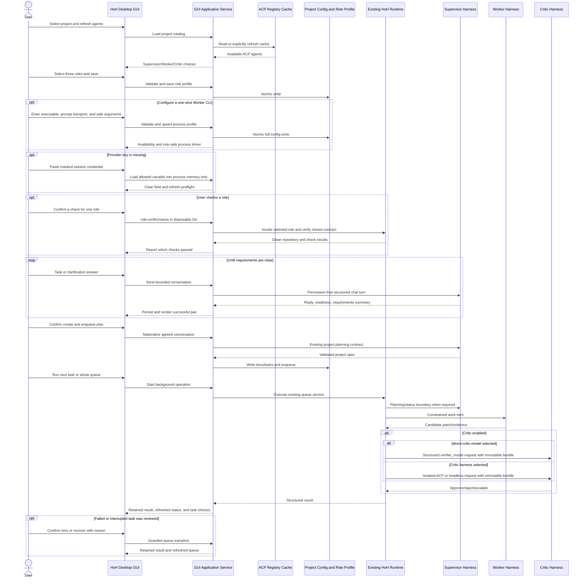

# HoH Desktop GUI

[Русский](gui.ru.md) · **English**

## Purpose

The desktop application is a thin control surface over the existing HoH configuration, role
profile, Supervisor conversation, ACP Registry, queue, doctor, and audit services. It must not
parse human-readable CLI output or duplicate orchestration rules.

Windows ships with an embedded Python/Tk runtime. The Debian package declares Python 3.11+, Tk,
and Git as package-manager dependencies. The macOS `.app` bundles Python and Tk. End users launch
HoH from their operating-system application menu and do not run Python commands.

## First-run setup

On a new user profile HoH opens **First-run setup** instead of dropping the operator into an
unconfigured role form. The guided flow is deliberately evidence-based:

1. choose a tested team preset;
2. install the exact ACP Registry versions into the current user profile;
3. use the vendor login controls (HoH does not read or copy vendor credential stores);
4. save the independent Supervisor, Worker, and Critic assignments.

Optionally, **Check this role** on any role card runs it once against a throwaway repository, so you
can see whether the agent and account work before pointing HoH at real code.

The bundled presets are Codex for all roles, Codex + Claude + DeepSeek (Qwen Code is the DeepSeek
ACP harness), and Codex + Claude + Gemini. Presets never bypass availability checks: missing or
uninstallable agents block role persistence and are explained in the UI.

At normal desktop size the Supervisor composer remains visible without page scrolling. The Agents
and connections cards stack at narrow widths, and A2A actions use a two-row responsive grid so no
button is clipped.

## Required role model

Every project exposes three independently configurable role slots:

| Role | Required | Responsibility | Repository authority |
| --- | --- | --- | --- |
| Supervisor | Yes | Clarifies intent, creates the plan, monitors execution, accepts the final result | Owns canonical Git and completion decisions |
| Worker | Yes | Implements one constrained work item at a time | Receives only the authority declared by the worker trust policy |
| Critic | No, but explicit | Independently reviews immutable evidence and approves, rejects, or escalates | Read-only; cannot modify the repository |

An ACP Registry agent may fill any or all three slots. Each slot has its own agent, optional model,
and explicit driver. Reusing one agent is supported, but the sessions and role identities remain
distinct. When Critic is disabled, the UI must say so explicitly and the Supervisor may close work
only after deterministic checks pass.

## User workflows

1. Select an existing Git project directory.
2. Refresh or load the cached ACP Registry.
3. Select Supervisor, Worker, and optional Critic independently.
4. Optionally pin a model for each selected role.
5. Set the Worker attempt limit and save `.hoh/role-profile.json`.
6. Describe the project task in **Supervisor chat**, answer focused clarification questions, and
   review the Supervisor's current requirements summary.
7. Confirm **Create and enqueue plan** to materialize the existing project-plan artifacts and queue.
8. Configure model endpoints, session-only credentials, runtime policy, and declarative Worker CLI
   profiles through guided forms. Raw JSON remains an expert escape hatch, not a daily-use
   requirement.
9. Configure **MCP policies** independently for Supervisor, Worker, and Critic: permission mode,
   allowed ACP tool categories, and role-scoped stdio/HTTP/SSE servers.
10. Review **Metrics**, add optional provider/model token rates, and compare invocation count,
   tokens, cost, duration, and verified quality by role.
11. Run Doctor, inspect queue/status/history, execute one task or the whole queue, retry a reviewed
   failure, recover a confirmed interrupted task, and run the final audit.
11. Read operation output in the selected UI language.

## Application settings

User-only presentation settings are stored outside a project:

- Windows: `%LOCALAPPDATA%\HoH\gui-settings.json`
- Other platforms: the XDG config directory or `~/.config/hoh/gui-settings.json`

The file contains `locale`, `theme`, `last_project_root`, onboarding completion, and the signed
release catalog URL. It never contains a publisher private key or update credential. Supported
locales are `ru` and `en`; supported themes are `light` and `dark`.
If the remembered project directory was deleted, HoH clears that startup hint and opens without
showing an error; choosing an existing non-Git directory manually still reports the normal
project validation error.

The settings page also contains the daily update workflow: import a public self-signed publisher
identity, check an HTTPS signed catalog, and download/install a hash-bound release beside the
currently running version. HoH never silently trusts a publisher and never overwrites its running
directory. Automatic startup installation is opt-in; it uses the same signature, platform, size,
hash, safe-extraction, side-by-side activation, and rollback checks as the manual button.

## Project settings

The GUI writes project configuration atomically to `.hoh/harness.json`. The CLI loads that file
automatically when `--config` is not supplied, so GUI and CLI have one effective configuration.
An explicit `--config` argument always takes precedence.

Role selections remain in `.hoh/role-profile.json`. This separation keeps transport/runtime policy
independent from the customer-facing selection of Supervisor, Worker, and Critic.

The settings screen shows these locations explicitly:

| Data | Location | Git scope |
| --- | --- | --- |
| Project runtime and safety policy | `<project>/.hoh/harness.json` | Project file; customer decides whether to track it |
| Role choices | `<project>/.hoh/role-profile.json` | Generated project artifact |
| Supervisor conversation | `<project-parent>/.hoh-state/<project>-<hash>/supervisor-chat.json` | Outside the project and canonical Git |
| Usage metrics | `<project-parent>/.hoh-state/<project>-<hash>/usage-metrics.jsonl` | Append-only local evidence outside project Git |
| Locale, theme, last project | `%LOCALAPPDATA%\HoH\gui-settings.json` | User profile only |
| API keys and tokens | Environment, or `%LOCALAPPDATA%\HoH\secrets` when you press Save | Never in the project or in Git; DPAPI-protected on Windows, 0600 elsewhere |

The **MCP policies** page is the guided editor for `supervisor.mcp`, `worker.mcp`, and
`critic.mcp`. Each role owns an independent permission allowlist and server list. Supervisor and
Critic default to `reject`; Worker keeps the previous isolated-worktree `allow_once` behavior until
the operator narrows it. A missing/unknown `toolCall.kind` maps to `other`, which is denied unless
explicitly selected. Permanent allow choices are never selected.

MCP stdio commands are resolved to the absolute executable path required by ACP v1. HTTP/SSE
connections require HTTPS except for loopback and are rejected if the selected agent did not
advertise the corresponding MCP capability. Process environment entries and HTTP headers are
entered as `target=SOURCE_ENV`: only `SOURCE_ENV` is persisted, missing variables stop before
`session/new`, and resolved values are redacted from protocol events.

The guided form edits Supervisor/Verifier model endpoints, bundled runtime policy, required task
checks, Worker trust, and scheduler parallelism. Saving it round-trips the full configuration, so
advanced fields not shown in the form are preserved. The raw JSON editor remains available under
**Advanced** and is validated before atomic replacement.

The **Metrics** page never downloads or assumes commercial prices. Optional rates are stored in
`.hoh/harness.json` as price per one million input/output tokens for an exact provider/model pair;
model `*` is a deliberate provider fallback. A cost reported by the provider or protocol takes
precedence. Invocations without token telemetry remain visible and are marked as unknown rather
than estimated. Quality comes from recorded completion/review outcomes, not a hidden subjective
score.

The role catalog adds two explicit model-only choices after their endpoint and credential preflight
passes:

- `direct-supervisor-model` uses the configured Supervisor model endpoint;
- `direct-critic-model` uses the configured Verifier/direct-Critic endpoint.

They are not harness aliases and never appear as Worker choices. Selecting one writes the explicit
`model_json` driver, provider, and model identity into the effective three-role configuration.

The role card shows a read-only **Connection method (automatic)** value instead of presenting the
internal driver id as an optional user setting. The friendly label keeps the exact id in brackets.
The method is selected from the agent's declared role contract:

- ACP for generic compatible local harnesses;
- strict model API JSON for direct Supervisor/Critic targets;
- stdin/stdout CLI contracts for configured generic processes;
- declarative one-shot CLI profiles with HoH-owned prompt/model flags;
- bounded named CLI integrations for Hermes, Claude Code, and OpenClaw;
- manual review-file exchange for Critic.

An agent and role may not be paired with an arbitrary transport. Adding another communication
method requires a declared driver profile and its safety/conformance checks; the GUI never silently
substitutes one.

The Settings page lists configured headless process profiles and executable discovery status. The
built-in Aider entry appears in the Worker selector only when `aider` resolves on `PATH`. The same
page can create, edit, and remove a custom `agents[].worker_process_profile` without raw JSON. It
explains every field, accepts one argument per line, and validates prompt transport plus mandatory,
forbidden, model, and version-probe arguments before atomic save. Secret-bearing CLI arguments are
rejected. An API key can be exported as an environment variable or saved from **Provider
credentials**, which keeps it in your user profile under operating-system protection; an exported
variable always wins. Removing the process profile currently
selected as Worker is blocked until another Worker profile is saved.

Each role card exposes **Check this role**. After confirmation, the GUI runs that role once in a
throwaway Git repository and reports every conformance check it performed. Nothing is stored: the
answer is about this machine right now, and a saved one only goes stale. **Compatibility matrix** on
Operations lists which agents are installed here, their version, and the roles their driver covers.

Unavailable launchers do not appear in the role selectors. The Save action validates the catalog
again before writing `.hoh/role-profile.json`. If an agent is later removed or disappears from
`PATH`, its saved role is shown as blocked; chat, role checks, and **Run next task** stop before
invoking a process or claiming a queued task. The Compatibility matrix still lists unavailable
combinations so the missing launcher and its status remain visible.

## Environment variables

An environment variable has a name and a value. HoH configuration stores only the name, for
example `OPENAI_API_KEY`; the provider SDK reads the secret value from the process environment when
the role runs. On Windows the value may come from User/System Environment Variables or from the
process that launched HoH. The GUI's **Check variables** action reports only defined/missing state
and never displays the value. **Session credentials** accepts a missing value in a masked field,
keeps it only in the current GUI process environment, clears the field immediately, and loses the
value when the window closes. It is never serialized or copied into operation output.

Provider defaults are `OPENAI_API_KEY` and `DEEPSEEK_API_KEY`. An explicit `api_key_env` replaces
the default name. `stub` is offline and needs no credential. `openai_compatible` requires both an
explicit HTTPS base URL (loopback HTTP is allowed) and an environment-variable name.

## Supervisor conversation

The conversation uses the Supervisor selected in `.hoh/role-profile.json`:

- `acp` starts a permission-rejected ACP session in an empty temporary directory;
- `model_json` uses the configured structured model endpoint;
- `command_json` sends the same closed chat contract through stdin/stdout.

Each successful turn stores the user message, Supervisor reply, readiness flag, and current
requirements summary atomically. A failed turn stores neither half, so the text remains in the
composer for correction/retry. History is bounded when sent back to the model, persists across GUI
restarts, is not added to Git, and is not encrypted at rest. **New conversation** deletes only this
project's chat file after confirmation.

**Create and enqueue plan** is a separate confirmed action. It passes the agreed summary and
transcript to the existing Supervisor planning adapter, writes `docs/hoh` and `tasks/hoh`, and
enqueues the generated tasks. The chat contract grants no repository path, Git, terminal, or
completion authority. ACP additionally advertises disabled filesystem/terminal capabilities and
rejects permission requests. A configured `command_json` executable is still an ordinary local OS
process; HoH gives it an empty temporary working directory but does not provide an OS sandbox.

## Security and safety

- Project configuration holds environment-variable names only. A credential you choose to save
  goes to the user profile, protected by the operating system, never to the project or Git.
  Optional masked values entered in the credentials dialog live only in process memory until the
  GUI closes. OAuth/OIDC device-flow access and refresh tokens are the exception: they are kept in a
  user-scoped cache outside the project so queue subprocesses can reuse the login; Windows protects
  each cache record with current-user DPAPI. Removing the user cache revokes HoH's local copy but
  does not revoke the provider grant.
- Unavailable configured/binary agents are omitted from selectable values. A stale or manually
  edited profile that names one is shown as blocked; chat, plan creation, and profile saving remain
  unavailable until the user selects an available agent.
- **Agents and connections** lists the cached ACP Registry with installed/installable/blocked
  states. Exact pinned npm/uv packages are installed under the user profile; direct archives require
  HTTPS and a Registry SHA-256 and are extracted with path, link, entry-count, and size limits.
- The same page inspects ACP `authMethods`, accepts declared environment fields only for the current
  process, and launches either protocol authentication or a known interactive vendor CLI. HoH never
  reads or stores the resulting vendor token.
- A2A v1 profiles specify Agent Card URL, permitted roles, timeout, transport preference, and auth.
  Bearer/API-key profiles reference an environment-variable name. OAuth2/OIDC profiles additionally
  select client-credentials or device-code flow, client environment names, scopes, and optional
  token/discovery/device endpoints. SSE is used when both sides advertise it; polling remains the
  bounded fallback. Push callbacks require a separate bearer token environment name. HTTPS is
  mandatory except for loopback. Remote Worker transfer is limited to explicit UTF-8
  `allowed_paths`; binary files, symlinks, traversal, and unbounded repositories fail closed.
- Registry refresh is explicit and reports network failures without discarding the previous cache.
- Long-running operations execute outside the Tk event loop and return results through scheduled UI
  callbacks.
- Mutating operations are visibly distinct from read-only status operations.
- Queue execution and final audit use the same leases, validation, and deterministic gates as the CLI.
- Unknown drivers and unavailable role agents fail explicitly; there is no silent fallback.
- MCP permissions are fail-closed per role. Unlisted tool kinds, unavailable server executables,
  missing secret variables, unsupported transports, and insecure remote URLs stop explicitly.
- Worker-owned commits fail even inside the disposable attempt: HoH compares Git `HEAD` with the
  starting commit before collecting the diff.

## UI coverage and engineering-only operations

The full daily project loop is available without a terminal: open a Git project; install, sign in,
and test local or remote agents; configure and check all three roles; converse with Supervisor;
create and enqueue the plan; execute one task or the entire queue; inspect history; retry/recover;
and run the final audit. **Projects** adds any number of Git roots to the user-scoped registry,
shows their actual queue totals and next ready task, opens or runs a selected project, and controls
its interval/final-audit/desktop/Telegram policy. The background runner is an explicit current-user
Windows Scheduled Task, Linux systemd timer, or macOS LaunchAgent; enabling a project schedule alone
never installs an OS service.
Operation output is retained after screen refresh.

Release-engineering and forensic maintenance commands intentionally remain outside the GUI:

- portable packaging, exact rollback,
  ledger reconciliation, raw review-file exchange, and journal export. These are documented CLI
  surfaces with additional evidence and confirmation requirements, not ordinary end-user setup.

The Advanced JSON editor remains for uncommon policy fields (Telegram integration, analyzer
selection, coordination timeouts, and path policy). Guided saves preserve those fields unchanged.

## Localization

All visible labels, buttons, validation errors, confirmations, status messages, and table headings
come from a closed translation catalog. Missing translation keys fail tests. Agent names, model
names, paths, commands, and raw diagnostic output are not translated.

## Theme behavior

The GUI uses semantic ttk styles rather than per-widget colors. Both themes define background,
surface, foreground, muted, accent, success, warning, error, focus, selection, and border colors.
Switching the theme applies immediately and persists only to user settings.

The desktop layout uses elevated card shells with soft theme-specific shadows and short hover/page
transitions. The canvas height is recalculated from the currently visible page, so a previously
opened taller page cannot leave a hidden scroll range or blank vertical gap. The Roles page fits
without vertical scrolling at the default desktop size. At narrower widths or genuinely smaller
heights the sidebar collapses to icons, the cards reflow from three columns to two and then one, and
the vertical viewport keeps a visible rail whenever a long page needs scrolling. Animations are deliberately brief
and do not delay an operation or carry state.

## GUI operation sequence

## Acceptance criteria

- Supervisor, Worker, and Critic have separate agent/model choices and a read-only, role-safe
  connection-method explanation.
- Critic can be explicitly disabled without removing Supervisor or Worker.
- The same ACP agent can be saved in all three slots and resolves to three ACP role adapters.
- An unavailable agent cannot be selected or persisted; stale unavailable profiles show a blocking
  reason rather than falling back to another harness.
- The settings page identifies every storage location and explains each common field and credential
  variable without exposing secret values.
- Custom one-shot Worker process profiles can be created, edited, and removed without raw JSON;
  unsafe or secret-bearing arguments fail before persistence.
- Session credentials are masked, cleared after submission, inherited by child operations, and
  never persisted.
- A multi-turn Supervisor conversation survives restart outside Git, and a confirmed transition
  uses it to create the existing validated project plan and queue.
- RU/EN and light/dark can be switched at runtime and survive restart.
- The full Russian navigation labels fit at the default width; compact mode uses icons rather than
  clipping labels.
- Role cards reflow at narrow widths and remain reachable through the content viewport.
- The Roles page has no hidden scroll range or blank gap at the default desktop size.
- No GUI operation blocks the window event loop.
- Queue history, audit history, whole-queue execution, failed-task retry, and confirmed interrupted-
  task recovery are available without a terminal, and their output survives the status refresh.
- Saved project configuration is consumed by CLI operations without an extra `--config` argument.
- Unit tests cover settings, localization, configuration round-trip, three-role persistence, and
  service error handling.
- A packaged-runtime smoke test creates and closes the GUI, and all four locale/theme combinations
  receive visual inspection before release.
