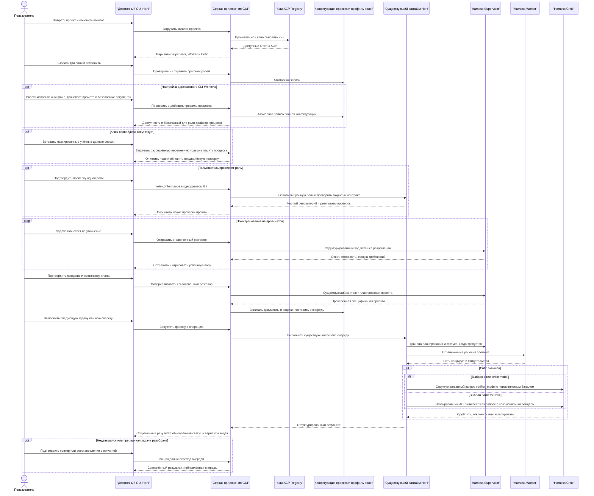

# Десктопный GUI HoH

[English](gui.md) · **Русский**

## Назначение

Десктопное приложение — тонкая управляющая поверхность над существующими сервисами HoH:
конфигурацией, профилем ролей, разговором с Supervisor, ACP Registry, очередью, doctor и аудитом.
Оно не должно разбирать человекочитаемый вывод CLI и дублировать правила оркестрации.

Windows поставляется со встроенным рантаймом Python и Tk. Пакет Debian объявляет Python 3.11+, Tk и
Git зависимостями пакетного менеджера. Бандл `.app` для macOS несёт Python и Tk внутри. Конечные
пользователи запускают HoH из меню приложений своей операционной системы и не выполняют команд
Python.

## Первый запуск

На новом профиле пользователя HoH открывает **Первый запуск**, а не бросает оператора в ненастроенную
форму ролей. Пошаговый процесс намеренно опирается на свидетельства:

1. выбрать проверенный пресет команды;
2. установить точные версии из ACP Registry в текущий профиль пользователя;
3. воспользоваться элементами вендорского входа (HoH не читает и не копирует вендорские хранилища
   учётных данных);
4. сохранить независимые назначения Supervisor, Worker и Critic.

По желанию кнопка **Проверить эту роль** на любой карточке роли один раз прогоняет её на одноразовом
репозитории, так что вы видите, работают ли агент и учётная запись, ещё до того, как направить HoH на
настоящий код.

Вложенные пресеты — Codex на все роли, Codex + Claude + DeepSeek (Qwen Code выступает
ACP-harness'ом для DeepSeek) и Codex + Claude + Gemini. Пресеты никогда не обходят проверки
доступности: отсутствующие или неустанавливаемые агенты блокируют сохранение ролей, и это объясняется
в интерфейсе.

При обычном размере рабочего стола поле ввода Supervisor остаётся видимым без прокрутки страницы.
Карточки агентов и подключений складываются в столбик на узких ширинах, а действия A2A используют
адаптивную сетку в два ряда, так что ни одна кнопка не обрезается.

## Обязательная модель ролей

Каждый проект выставляет три независимо настраиваемых слота ролей:

| Роль | Обязательна | Ответственность | Полномочия в репозитории |
| --- | --- | --- | --- |
| Supervisor | Да | Уточняет намерение, создаёт план, следит за исполнением, принимает финальный результат | Владеет каноническим Git и решениями о завершении |
| Worker | Да | Реализует по одному ограниченному рабочему элементу | Получает только те полномочия, что объявлены политикой доверия worker'у |
| Critic | Нет, но явно | Независимо ревьюит неизменяемые свидетельства и одобряет, отклоняет или эскалирует | Только чтение; не может менять репозиторий |

Агент ACP Registry может занять любой из трёх слотов или все сразу. У каждого слота свой агент,
необязательная модель и явный драйвер. Переиспользование одного агента поддерживается, но сессии и
ролевые личности остаются раздельными. Когда Critic выключен, интерфейс обязан сказать об этом явно, а
Supervisor вправе закрыть работу только после прохождения детерминированных проверок.

## Сценарии пользователя

1. Выбрать существующий каталог Git-проекта.
2. Обновить или загрузить закэшированный ACP Registry.
3. Независимо выбрать Supervisor, Worker и необязательного Critic.
4. При желании закрепить модель за каждой выбранной ролью.
5. Задать предел попыток Worker'а и сохранить `.hoh/role-profile.json`.
6. Описать задачу проекта в **чате с Supervisor**, ответить на точечные уточняющие вопросы и изучить
   текущую сводку требований от Supervisor.
7. Подтвердить **Создать и поставить план в очередь**, чтобы материализовать существующие артефакты
   плана проекта и очередь.
8. Настроить эндпоинты моделей, учётные данные только на сессию, политику рантайма и декларативные
   CLI-профили Worker через пошаговые формы. Сырой JSON остаётся запасным выходом для эксперта, а не
   требованием повседневной работы.
9. Настроить **политики MCP** независимо для Supervisor, Worker и Critic: режим разрешений,
   допустимые категории инструментов ACP и серверы stdio/HTTP/SSE в области роли.
10. Изучить **Метрики**, добавить необязательные ставки за токены по провайдеру и модели и сравнить
    число вызовов, токены, стоимость, длительность и подтверждённое качество по ролям.
11. Запустить Doctor, изучить очередь, статус и историю, выполнить одну задачу или всю очередь,
    повторить разобранный отказ, восстановить подтверждённую прерванную задачу и запустить финальный
    аудит.
12. Прочитать вывод операции на выбранном языке интерфейса.

## Настройки приложения

Настройки представления, принадлежащие только пользователю, хранятся вне проекта:

- Windows: `%LOCALAPPDATA%\HoH\gui-settings.json`
- Другие платформы: каталог конфигурации XDG или `~/.config/hoh/gui-settings.json`

Файл содержит `locale`, `theme`, `last_project_root`, признак завершения первого запуска и URL
подписанного каталога релизов. В нём никогда нет приватного ключа издателя и учётных данных
обновления. Поддерживаемые языки — `ru` и `en`; поддерживаемые темы — `light` и `dark`. Если
запомненный каталог проекта был удалён, HoH очищает эту стартовую подсказку и открывается без
сообщения об ошибке; ручной выбор существующего каталога, не являющегося Git-репозиторием,
по-прежнему выдаёт обычную ошибку проверки проекта.

На странице настроек находится и ежедневный процесс обновления: импорт публичной самоподписанной
личности издателя, проверка подписанного каталога по HTTPS и скачивание и установка связанного хешем
релиза рядом с работающей версией. HoH никогда не доверяет издателю молча и никогда не перезаписывает
свой рабочий каталог. Автоматическая установка при старте включается явно; она использует те же
проверки подписи, платформы, размера, хеша, безопасной распаковки, активации рядом и отката, что и
кнопка ручного обновления.

## Настройки проекта

GUI пишет конфигурацию проекта атомарно в `.hoh/harness.json`. CLI загружает этот файл автоматически,
когда `--config` не передан, поэтому у GUI и CLI одна действующая конфигурация. Явный аргумент
`--config` всегда имеет приоритет.

Выбор ролей остаётся в `.hoh/role-profile.json`. Это разделение держит политику транспорта и рантайма
независимой от обращённого к заказчику выбора Supervisor, Worker и Critic.

Экран настроек показывает эти расположения явно:

| Данные | Расположение | Отношение к Git |
| --- | --- | --- |
| Политика рантайма и безопасности проекта | `<проект>/.hoh/harness.json` | Файл проекта; заказчик решает, отслеживать ли его |
| Выбор ролей | `<проект>/.hoh/role-profile.json` | Порождённый артефакт проекта |
| Разговор с Supervisor | `<родитель-проекта>/.hoh-state/<проект>-<хеш>/supervisor-chat.json` | Вне проекта и канонического Git |
| Метрики использования | `<родитель-проекта>/.hoh-state/<проект>-<хеш>/usage-metrics.jsonl` | Дописываемое локальное свидетельство вне Git проекта |
| Язык, тема, последний проект | `%LOCALAPPDATA%\HoH\gui-settings.json` | Только профиль пользователя |
| API-ключи и токены | Окружение или `%LOCALAPPDATA%\HoH\secrets` при нажатии «Сохранить» | Никогда в проекте и в Git; защищены DPAPI на Windows, режимом 0600 в остальных системах |

Страница **Политики MCP** — пошаговый редактор для `supervisor.mcp`, `worker.mcp` и `critic.mcp`. У
каждой роли независимый разрешительный список и список серверов. Supervisor и Critic по умолчанию
стоят на `reject`; Worker сохраняет прежнее поведение `allow_once` для изолированного worktree, пока
оператор его не сузит. Отсутствующий или неизвестный `toolCall.kind` отображается в `other`, который
запрещён, если не выбран явно. Постоянные разрешения не выбираются никогда.

Stdio-команды MCP разрешаются до абсолютного пути исполняемого файла, как того требует ACP v1.
Соединения HTTP/SSE требуют HTTPS, кроме loopback, и отклоняются, если выбранный агент не объявил
соответствующую возможность MCP. Записи окружения процесса и заголовки HTTP вводятся как
`цель=ИСХОДНАЯ_ПЕРЕМЕННАЯ`: сохраняется только `ИСХОДНАЯ_ПЕРЕМЕННАЯ`, отсутствующие переменные
останавливают процесс до `session/new`, а разрешённые значения вырезаются из событий протокола.

Пошаговая форма правит эндпоинты моделей Supervisor и Verifier, политику вложенного рантайма,
обязательные проверки задач, доверие Worker'у и параллелизм планировщика. Её сохранение прогоняет
конфигурацию целиком туда и обратно, так что продвинутые поля, не показанные в форме, сохраняются.
Редактор сырого JSON остаётся доступен в разделе **Дополнительно** и проверяется до атомарной замены.

Страница **Метрики** никогда не скачивает и не предполагает коммерческие цены. Необязательные ставки
хранятся в `.hoh/harness.json` как цена за один миллион входных и выходных токенов для точной пары
провайдер/модель; модель `*` — намеренный запасной вариант провайдера. Стоимость, сообщённая
провайдером или протоколом, имеет приоритет. Вызовы без телеметрии токенов остаются видимы и
помечаются как неизвестные, а не оцениваются. Качество берётся из записанных исходов завершения и
ревью, а не из скрытой субъективной оценки.

Каталог ролей добавляет два явных выбора «только модель» после того, как их эндпоинт и учётные данные
прошли предполётную проверку:

- `direct-supervisor-model` использует настроенный эндпоинт модели Supervisor;
- `direct-critic-model` использует настроенный эндпоинт Verifier или прямого Critic.

Это не псевдонимы harness'ов, и в качестве Worker они не появляются никогда. Выбор одного из них
записывает явный драйвер `model_json`, провайдера и личность модели в действующую трёхролевую
конфигурацию.

Карточка роли показывает значение **Способ подключения (автоматически)** только на чтение, а не
выставляет внутренний идентификатор драйвера как необязательную пользовательскую настройку. Понятная
подпись сохраняет точный идентификатор в скобках. Способ выбирается из объявленного ролевого контракта
агента:

- ACP для обычных совместимых локальных harness'ов;
- строгий JSON API модели для прямых целей Supervisor и Critic;
- контракты CLI через stdin/stdout для настроенных обычных процессов;
- декларативные одноразовые профили CLI с флагами промпта и модели, которыми владеет HoH;
- ограниченные именованные интеграции CLI для Hermes, Claude Code и OpenClaw;
- ручной обмен файлами ревью для Critic.

Агент и роль не могут быть соединены с произвольным транспортом. Добавление другого способа связи
требует объявленного профиля драйвера и его проверок безопасности и соответствия; GUI никогда не
подменяет один другим молча.

Страница настроек перечисляет настроенные headless-профили процессов и статус обнаружения исполняемых
файлов. Встроенная запись Aider появляется в селекторе Worker, только когда `aider` разрешается по
`PATH`. Та же страница позволяет создать, отредактировать и удалить собственный
`agents[].worker_process_profile` без сырого JSON. Она объясняет каждое поле, принимает по одному
аргументу на строку и проверяет транспорт промпта, а также обязательные, запрещённые, модельные и
пробующие версию аргументы до атомарного сохранения. Аргументы CLI, несущие секреты, отклоняются.
API-ключ можно экспортировать переменной окружения или сохранить через **Учётные данные
провайдера**, которые держат его в профиле пользователя под защитой операционной системы;
экспортированная переменная всегда побеждает. Удаление профиля процесса, выбранного сейчас как
Worker, заблокировано, пока не сохранён другой профиль Worker.

На каждой карточке роли есть кнопка **Проверить эту роль**. После подтверждения GUI один раз прогоняет
эту роль в одноразовом Git-репозитории и сообщает о каждой выполненной проверке соответствия. Ничего
не сохраняется: ответ относится к этой машине прямо сейчас, а сохранённый только устаревает.
**Матрица совместимости** на странице «Операции» перечисляет, какие агенты установлены здесь, их
версию и роли, которые покрывает их драйвер.

Недоступные лаунчеры в селекторах ролей не появляются. Действие «Сохранить» проверяет каталог ещё раз
до записи `.hoh/role-profile.json`. Если агента позже удалили или он исчез из `PATH`, его сохранённая
роль показывается как заблокированная; чат, проверки ролей и **Выполнить следующую задачу**
останавливаются до запуска процесса и до захвата задачи из очереди. Матрица совместимости всё равно
перечисляет недоступные сочетания, так что отсутствующий лаунчер и его статус остаются видимы.

## Переменные окружения

У переменной окружения есть имя и значение. Конфигурация HoH хранит только имя, например
`OPENAI_API_KEY`; SDK провайдера читает секретное значение из окружения процесса, когда роль
исполняется. На Windows значение может приходить из пользовательских или системных переменных
окружения либо из процесса, запустившего HoH. Действие **Проверить переменные** в GUI сообщает только
состояние «определена/отсутствует» и никогда не показывает значение. **Учётные данные сессии**
принимают отсутствующее значение в маскированное поле, держат его только в окружении текущего процесса
GUI, немедленно очищают поле и теряют значение при закрытии окна. Оно никогда не сериализуется и не
копируется в вывод операций.

Значения по умолчанию для провайдеров — `OPENAI_API_KEY` и `DEEPSEEK_API_KEY`. Явный `api_key_env`
заменяет имя по умолчанию. `stub` работает офлайн и учётных данных не требует. `openai_compatible`
требует и явного базового URL по HTTPS (loopback по HTTP допустим), и имени переменной окружения.

## Разговор с Supervisor

Разговор использует Supervisor, выбранного в `.hoh/role-profile.json`:

- `acp` запускает ACP-сессию с отклонением разрешений в пустом временном каталоге;
- `model_json` использует настроенный эндпоинт структурированной модели;
- `command_json` отправляет тот же закрытый контракт чата через stdin и stdout.

Каждый успешный ход атомарно сохраняет сообщение пользователя, ответ Supervisor'а, признак готовности
и текущую сводку требований. Неудавшийся ход не сохраняет ни одной половины, поэтому текст остаётся в
поле ввода для правки и повтора. История ограничена при отправке обратно модели, переживает
перезапуск GUI, в Git не добавляется и на диске не шифруется. **Новый разговор** удаляет после
подтверждения только файл чата этого проекта.

**Создать и поставить план в очередь** — отдельное подтверждаемое действие. Оно передаёт согласованную
сводку и стенограмму существующему адаптеру планирования Supervisor'а, пишет `docs/hoh` и `tasks/hoh`
и ставит порождённые задачи в очередь. Контракт чата не даёт ни пути к репозиторию, ни Git, ни
терминала, ни полномочий завершения. ACP дополнительно объявляет отключёнными возможности файловой
системы и терминала и отклоняет запросы разрешений. Настроенный исполняемый файл `command_json` всё
равно остаётся обычным локальным процессом ОС; HoH даёт ему пустой временный рабочий каталог, но не
предоставляет песочницу ОС.

## Безопасность

- Конфигурация проекта хранит только имена переменных окружения. Учётные данные, которые вы решили
  сохранить, уходят в профиль пользователя под защиту операционной системы, но никогда в проект и в
  Git. Необязательные маскированные значения, введённые в диалоге учётных данных, живут только в
  памяти процесса до закрытия GUI. Исключение — токены доступа и обновления device-flow OAuth и OIDC:
  они хранятся в пользовательском кэше вне проекта, чтобы подпроцессы очереди могли переиспользовать
  вход; на Windows каждая запись кэша защищена DPAPI текущего пользователя. Удаление пользовательского
  кэша отзывает локальную копию у HoH, но не отзывает выданное провайдером разрешение.
- Недоступные настроенные и бинарные агенты исключаются из выбираемых значений. Устаревший или
  отредактированный вручную профиль, называющий такого агента, показывается как заблокированный; чат,
  создание плана и сохранение профиля остаются недоступны, пока пользователь не выберет доступного
  агента.
- **Агенты и подключения** перечисляют закэшированный ACP Registry с состояниями «установлен»,
  «можно установить» и «заблокирован». Точно закреплённые пакеты npm и uv устанавливаются под профиль
  пользователя; прямые архивы требуют HTTPS и SHA-256 из Registry и распаковываются с ограничениями на
  пути, ссылки, число записей и размер.
- Та же страница изучает `authMethods` из ACP, принимает объявленные поля окружения только для
  текущего процесса и запускает либо аутентификацию по протоколу, либо известный интерактивный
  вендорский CLI. Получившийся вендорский токен HoH не читает и не хранит.
- Профили A2A v1 задают URL Agent Card, разрешённые роли, таймаут, предпочтение транспорта и
  аутентификацию. Профили bearer и API-key ссылаются на имя переменной окружения. Профили OAuth2 и
  OIDC дополнительно выбирают поток client-credentials или device-code, имена переменных клиента,
  области и необязательные эндпоинты токена, обнаружения и устройства. SSE используется, когда его
  объявляют обе стороны; опрос остаётся ограниченным запасным вариантом. Push-обратные вызовы требуют
  отдельного имени переменной с bearer-токеном. HTTPS обязателен, кроме loopback. Передача удалённому
  Worker'у ограничена явными `allowed_paths` в UTF-8; двоичные файлы, символические ссылки, выход за
  пределы дерева и неограниченные репозитории приводят к отказу закрытым.
- Обновление Registry выполняется явно и сообщает о сетевых отказах, не выбрасывая прежний кэш.
- Долгие операции выполняются вне цикла событий Tk и возвращают результаты через запланированные
  обратные вызовы интерфейса.
- Изменяющие операции визуально отличаются от операций статуса только на чтение.
- Исполнение очереди и финальный аудит используют те же аренды, проверки и детерминированные гейты,
  что и CLI.
- Неизвестные драйверы и недоступные агенты ролей приводят к явному отказу; молчаливого отката нет.
- Разрешения MCP отказывают закрытым по каждой роли. Неперечисленные виды инструментов, недоступные
  исполняемые файлы серверов, отсутствующие переменные секретов, неподдерживаемые транспорты и
  небезопасные удалённые URL останавливают работу явно.
- Коммиты, созданные worker'ом, приводят к отказу даже внутри одноразовой попытки: HoH сравнивает
  `HEAD` Git с исходным коммитом до сбора diff.

## Покрытие интерфейсом и операции только для инженеров

Полный ежедневный цикл работы над проектом доступен без терминала: открыть Git-проект; установить,
войти и проверить локальных или удалённых агентов; настроить и проверить все три роли; поговорить с
Supervisor; создать и поставить план в очередь; выполнить одну задачу или всю очередь; изучить
историю; повторить или восстановить; запустить финальный аудит. Страница **Проекты** добавляет любое
число корней Git в пользовательский реестр, показывает их фактические итоги очереди и следующую
готовую задачу, открывает или запускает выбранный проект и управляет его политикой интервала,
финального аудита, рабочего стола и Telegram. Фоновый исполнитель — это явное запланированное задание
Windows для текущего пользователя, таймер systemd на Linux или LaunchAgent на macOS; само по себе
включение расписания проекта службу ОС не устанавливает. Вывод операции сохраняется после обновления
экрана.

Команды релизной инженерии и криминалистического обслуживания намеренно остаются вне GUI:

- сборка переносимого пакета, точный откат, сверка журнала, сырой обмен файлами ревью и экспорт
  журнала. Это документированные поверхности CLI с дополнительными требованиями к свидетельствам и
  подтверждениям, а не обычная настройка конечного пользователя.

Редактор сырого JSON в разделе «Дополнительно» остаётся для нечастых полей политики (интеграция с
Telegram, выбор анализаторов, таймауты координации и политика путей). Пошаговые сохранения оставляют
эти поля без изменений.

## Локализация

Все видимые подписи, кнопки, ошибки проверки, подтверждения, сообщения статуса и заголовки таблиц
берутся из закрытого каталога переводов. Отсутствующие ключи перевода роняют тесты. Имена агентов,
имена моделей, пути, команды и сырой диагностический вывод не переводятся.

## Поведение темы

GUI использует семантические стили ttk, а не цвета для каждого виджета. Обе темы определяют цвета
фона, поверхности, текста, приглушённого текста, акцента, успеха, предупреждения, ошибки, фокуса,
выделения и границы. Переключение темы применяется немедленно и сохраняется только в пользовательских
настройках.

Раскладка рабочего стола использует приподнятые карточки с мягкими тенями под каждую тему и короткими
переходами при наведении и смене страницы. Высота холста пересчитывается по текущей видимой странице,
поэтому ранее открытая более высокая страница не может оставить скрытый диапазон прокрутки или пустой
вертикальный промежуток. Страница ролей помещается без вертикальной прокрутки при размере рабочего
стола по умолчанию. При меньшей ширине или действительно меньшей высоте боковая панель сворачивается в
иконки, карточки перестраиваются с трёх колонок на две, а затем на одну, а вертикальный вьюпорт
сохраняет видимую полосу всякий раз, когда длинной странице нужна прокрутка. Анимации намеренно
коротки и не задерживают операцию и не несут состояния.

## Последовательность работы GUI

## Критерии приёмки

- У Supervisor, Worker и Critic раздельные выборы агента и модели и объяснение способа подключения —
  только на чтение и безопасное для роли.
- Critic можно явно отключить, не убирая Supervisor и Worker.
- Один и тот же агент ACP можно сохранить во все три слота, и он разрешается в три ролевых
  ACP-адаптера.
- Недоступного агента нельзя выбрать и сохранить; устаревшие профили с недоступным агентом
  показывают блокирующую причину, а не откатываются к другому harness'у.
- Страница настроек называет каждое место хранения и объясняет каждое распространённое поле и
  переменную с учётными данными, не раскрывая секретных значений.
- Собственные одноразовые профили процессов Worker можно создавать, править и удалять без сырого
  JSON; небезопасные и несущие секреты аргументы отклоняются до сохранения.
- Учётные данные сессии маскированы, очищаются после отправки, наследуются дочерними операциями и
  никогда не сохраняются.
- Многоходовый разговор с Supervisor переживает перезапуск вне Git, а подтверждённый переход
  использует его, чтобы создать существующий проверенный план проекта и очередь.
- RU/EN и светлую/тёмную темы можно переключать на ходу, и они переживают перезапуск.
- Полные русские подписи навигации помещаются при ширине по умолчанию; компактный режим использует
  иконки, а не обрезает подписи.
- Карточки ролей перестраиваются на узких ширинах и остаются достижимы через вьюпорт содержимого.
- У страницы ролей нет скрытого диапазона прокрутки и пустого промежутка при размере рабочего стола
  по умолчанию.
- Ни одна операция GUI не блокирует цикл событий окна.
- История очереди, история аудита, выполнение всей очереди, повтор неудавшейся задачи и
  восстановление подтверждённой прерванной задачи доступны без терминала, а их вывод переживает
  обновление статуса.
- Сохранённая конфигурация проекта потребляется операциями CLI без дополнительного аргумента
  `--config`.
- Модульные тесты покрывают настройки, локализацию, круговой проход конфигурации, сохранение трёх
  ролей и обработку ошибок сервиса.
- Смоук на упакованном рантайме создаёт и закрывает GUI, а все четыре сочетания языка и темы проходят
  визуальный осмотр до релиза.
