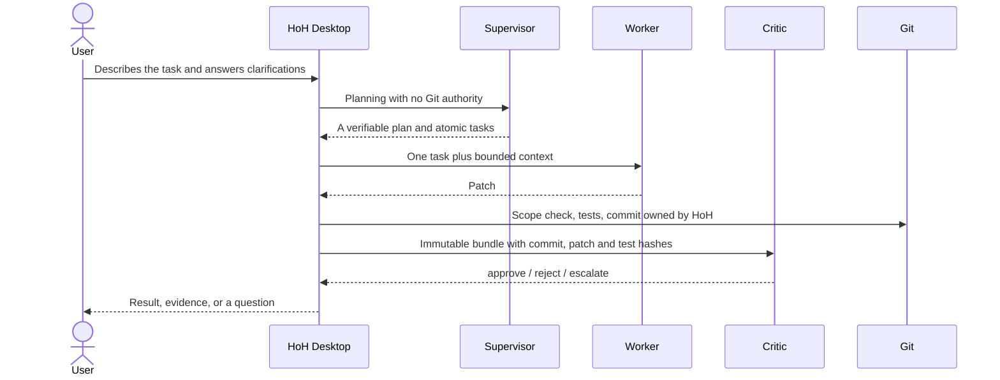

# HoH — user overview

[Русский](overview.ru.md) · **English**

## What it is

HoH is a local Windows/Linux/macOS desktop application and an authenticated
headless service for a three-role AI workflow:

- **Supervisor** discusses the request with the user, clarifies requirements,
  creates a plan, controls the queue, and makes the final decision.
- **Worker** applies bounded changes in an isolated Git worktree and returns a
  patch or commit evidence.
- **Critic** independently checks immutable evidence and returns `approve`,
  `reject`, or `escalate` without changing the project.

The user chooses an agent, model, and communication driver separately for every
role. A Supervisor and Worker can use Codex ACP while the Critic uses another
ACP harness, a direct DeepSeek-compatible API, or a remote A2A service. HoH does
not infer a driver from a product name.

## Installation and startup

- **Windows 10/11:** run `HoH-Setup-<version>.exe`. The installer is per-user,
  creates a Start-menu entry, and supports normal uninstall.
- **Ubuntu/Debian:** open `hoh_<version>_<architecture>.deb` in the package
  center or install it with the system package manager. Python and Tk are inside
  the package, as on the other two systems; only Git is a dependency.
- **macOS:** open `HoH-<version>.dmg` and drag `HoH.app` to Applications.
  Python and Tk are bundled inside the application.

The ZIP archives in `dist/` are build or update-channel artifacts, not a second
end-user installation mode.

Local ACP/CLI agents do not need a domain, public certificate, or OAuth. Those
settings are only for remote A2A services. A loopback callback can use HTTP;
an externally reachable endpoint must use HTTPS and an operator-provided
certificate/key.

## Desktop UI

1. **First run** — select a team preset, install pinned agents, open vendor
   login, and assign the three roles.
2. **Supervisor chat** — describe the work, answer clarifying questions, and
   confirm conversion of the conversation into a project plan and queue.
3. **Roles** — choose an independent agent, model, and compatible driver for
   Supervisor, Worker, and Critic. Missing agents are rejected before save or
   start.
4. **Agents and connections** — refresh the official ACP Registry, install or
   remove HoH-managed versions, inspect login methods, launch vendor login, and
   create remote A2A v1 connections.
5. **Project settings** — configure model endpoints, runtime, Worker trust,
   environment-variable names, one-shot process profiles, expert JSON, and the
   signed side-by-side update catalog. Secret values are never written to the
   project file.
6. **MCP policies** — configure separate tool categories and stdio/HTTP/SSE
   servers for each role. Unknown categories are blocked.
7. **Operations** — use Doctor, queue/history, retry/recovery, metrics,
   scheduler, notifications, role checks, and final audit.

The interface is available in Russian and English, supports light and dark
themes, and uses a responsive layout with vertical scrolling only when the
selected page needs it.

## Supported agent boundaries

### Local ACP agents

Any agent that conforms to ACP v1 and is correctly described in the Registry
uses one shared driver for Supervisor, Worker, and Critic. HoH contains no list
of product-specific `if agent == ...` branches.

Installation goes into the per-user directory `%LOCALAPPDATA%\HoH\agents`:

- npm and uv packages must carry an exact pinned version;
- a direct archive is downloaded only over HTTPS and only when the Registry
  publishes a SHA-256;
- ZIP and tar archives are checked for traversal, links, devices, entry count,
  and total size;
- the installation is assembled in a temporary directory first, then published
  atomically with a receipt;
- a damaged managed installation blocks startup instead of silently falling back
  to a network launcher.

If the Registry publishes no SHA-256, automatic installation is deliberately
unavailable. This is not a broken feature: HoH cannot safely confirm where such
a binary came from. The operator may install it on `PATH` themselves under their
own supply-chain policy.

### Headless process and direct model targets

A non-ACP CLI joins through a declarative one-shot process profile. The Worker
profile describes the command, how the prompt is delivered, required and
forbidden arguments, the model flag, and the version probe. Direct
OpenAI/DeepSeek/OpenAI-compatible endpoints are available for a structured
Supervisor and a read-only Critic. A raw model is not a Worker: it needs a
harness that supplies tools.

### Remote A2A agents

HoH implements A2A v1 JSON-RPC: Agent Card discovery, `SendMessage`, `GetTask`,
`CancelTask`, immediate messages or long-running tasks, text and data artifacts,
timeouts, and bounded response sizes.

- OAuth2/OIDC supports discovery, `client_credentials`, and interactive
  `device_code`; the project stores only environment-variable names and public
  endpoint metadata.
- When the Agent Card advertises streaming, HoH uses `SendStreamingMessage` and
  `SubscribeToTask` over SSE; otherwise it can wait for an authenticated push
  callback, and bounded polling remains the compatible fallback.
- For a loopback callback the desktop process raises a temporary HTTP receiver
  itself. In server mode an external HTTPS callback is routed to `/v1/a2a/push`
  of the same HoH process that is running the task; that endpoint uses a
  separate push token.
- HTTPS is mandatory for external addresses; HTTP is allowed only on loopback.
- Bearer and API-key values are read by environment-variable name and are never
  written to configuration.
- A remote Worker receives only UTF-8 files from an explicit `allowed_paths`:
  not the whole repository, not `.git`, not symlinks, not binaries. The response
  must contain a valid unified diff.
- A remote Critic receives the immutable review bundle; a remote Supervisor
  receives only the task and planning context, with no local Git authority.

## Login and secrets

HoH first reads the `authMethods` advertised by the ACP agent. Protocol login,
terminal authentication with the exact advertised command, and
environment-variable authentication are all supported. For known CLIs there is
also vendor login and status, including Codex, Claude, Gemini, GitHub/Copilot
and Jules.

HoH neither receives nor stores the vendor token. Interactive login happens in
the CLI's own window, and long-lived credentials stay in the vendor's store.
Keys typed into the UI exist only in process memory until the window closes.
Only environment-variable names are written to the project.

The exception is OAuth/OIDC `device_code` for a remote A2A service: the access
and refresh tokens are kept for background runs in a per-user cache protected by
Windows DPAPI, or a separate `0600` file on Linux and macOS. Client secrets and
static API keys still come only from the environment.

## Where data is stored

| Data | Location |
|---|---|
| Project settings and A2A metadata | `<project>/.hoh/harness.json` |
| The three role choices | `<project>/.hoh/role-profile.json` |
| Queue, history, review and audit evidence | user-scope `.hoh-state/<project-hash>` |
| Private Supervisor chat | `.hoh-state/<project-hash>/supervisor-chat.json` |
| Invocation, token, cost, duration and quality metrics | `.hoh-state/<project-hash>/usage-metrics.jsonl` |
| UI locale, theme and last project | `%LOCALAPPDATA%\HoH\gui-settings.json` |
| Project registry and schedules | `%LOCALAPPDATA%\HoH\workspace-v1.json` |
| Local notification log | `%LOCALAPPDATA%\HoH\desktop-notifications.jsonl` |
| Managed ACP agents | `%LOCALAPPDATA%\HoH\agents` |
| Trusted publisher public keys | `%LOCALAPPDATA%\HoH\trusted-publishers-v1.json` |
| A2A OAuth/OIDC token cache | `%LOCALAPPDATA%\HoH\oauth-tokens` (Windows DPAPI) |
| Installed HoH versions | `%LOCALAPPDATA%\Programs\HoH\versions` |
| API keys and vendor tokens | only the process or OS user environment, or the vendor's store |

On Linux the per-user files follow the XDG directories (`~/.config/hoh`,
`~/.local/state/hoh`, `~/.local/share/hoh`). On macOS the application lives in
`/Applications/HoH.app` and user data in `~/Library/Application Support/HoH`
plus the standard user state directories. Secrets still never reach the project.

MCP API-key values and HTTP header values are not stored either.
`.hoh/harness.json` holds only a binding of the form
`Authorization=MCP_TOKEN_ENV`; the value is substituted immediately before the
ACP `session/new` call and replaced with `<redacted>` in the local journal. By
default Supervisor and Critic have no tools, and Worker runs in an isolated
worktree with `allow_once`; the user can narrow its categories all the way to a
complete refusal.

The **Metrics** page groups evidence by role, agent, provider, and model. HoH
uses the cost reported by the protocol, or an explicit per-million-token rate
the user entered; there are no hidden built-in prices and no estimated tokens.
Rates are saved in `.hoh/harness.json` and events in an append-only state
journal outside Git.

The **Projects** page aggregates the real queues of several Git projects without
moving tasks into a separate database. Each project can have its own interval,
final audit, and notification channels. The user separately enables a background
service for the current user: a Windows Scheduled Task, a systemd user timer on
Linux, or a LaunchAgent on macOS. Every due run invokes the same
`queue-run-loop`, so leases, roles, Critic, and Git policy are not bypassed.

Without the desktop UI, HoH starts with the `server` command. The
bearer-protected API exposes the project list, queues, metrics, Supervisor chat
and plan, a manual project run, and a run of every due project. An external bind
requires a TLS certificate and key; OpenAPI is served at `/v1/openapi.json`.

Settings can enable automatic checking and side-by-side installation of trusted
updates at startup. It uses only a previously imported public key, a signed
HTTPS catalog, and exact size and SHA-256; the application's current directory
is never overwritten.

## What happens when a task runs



The Worker does not create the final commit and does not approve its own work.
The Critic cannot change the project. Queue state, Git mutation, and review are
tied together by the journal, the leases, and the operation ledger, so an
ambiguous crash never turns into a hidden success.

## What “supported” means

HoH separates three claims:

1. **Protocol support** — the driver understands the transport and envelope.
2. **Local availability** — the executable or package is present and passes
   Doctor checks. `compatibility-matrix` answers exactly this one question, with
   `available` or `unavailable` and nothing more.
3. **It actually ran here** — `role-conformance --role <role>`, or **Check this
   role** in the interface, completed a throwaway-repository run with your agent,
   model and account.

One claim never implies the next. Being listed in the Registry does not prove
that this version, account, model and quota work here. A package that starts
does not mean a vendor account is logged in, and an agent being on `PATH` does
not mean it will produce a usable patch. Only the third claim answers that, and
only for the machine you asked it on — which is why HoH stores no record of it:
a saved answer goes stale silently.

## Engineering-only operations

The terminal keeps the engineering operations where explicit reproducibility and
evidence matter more than convenience: building installers and the internal
update payload, exact rollback, ledger reconciliation, manual review-file
exchange, and journal export. Agent installation, vendor login, and A2A are no
longer on that list.

The CLI equivalents of the setup operations are:

```powershell
.\scripts\hoh.ps1 agent-manage list --refresh --json
.\scripts\hoh.ps1 agent-manage install --agent codex-acp --json
.\scripts\hoh.ps1 agent-manage auth --agent codex-acp --json
.\scripts\hoh.ps1 agent-manage login --agent codex-acp
.\scripts\hoh.ps1 a2a-test --name remote-supervisor --json
.\scripts\hoh.ps1 publisher import --publisher C:\path\publisher.public.json
.\scripts\hoh.ps1 update check --source https://host/HoH-releases.signed.json
.\scripts\hoh.ps1 update install --source https://host/HoH-releases.signed.json
```

## Release boundary

The application closes the daily local scenario from installation and login to
plan, execution, independent review, and final audit. What remains external is
only the facts HoH does not own: network availability, vendor account and
organization policy, quota, licensing, the correctness of a third-party service,
and OAuth/OIDC client registration for a particular A2A provider. Those are
checked explicitly and never replaced by a fictitious success.

The current release contains native Windows, Ubuntu/Debian, and macOS packages,
the authenticated headless API, and bilingual UI. Native package smoke is
documented separately from whether any provider account works. For exact
package hashes, target instructions, manual GitHub upload, and the vendor-login
gates that remain, see [`docs/release.md`](release.md) and the paste-ready
[`RELEASE_NOTES.md`](../RELEASE_NOTES.md).
