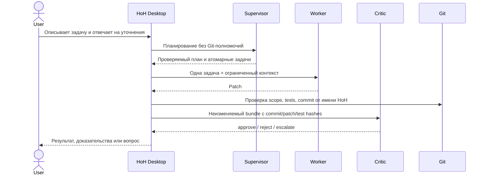

# HoH — обзор приложения для пользователя

[English](overview.md) · **Русский**

## Что это

HoH — локальное Windows/Linux/macOS-приложение и защищённый headless-сервис, который управляет
командой из трёх независимо назначаемых AI-ролей:

- **Supervisor** обсуждает задачу с пользователем, уточняет требования, строит план, управляет
  очередью и принимает итоговое решение;
- **Worker** выполняет ограниченные изменения в изолированном Git worktree и возвращает патч;
- **Critic** независимо читает неизменяемые доказательства, не меняет проект и выдаёт
  `approve`, `reject` или `escalate`.

Пользователь выбирает агент, модель и способ связи отдельно для каждой роли. Например, Supervisor и
Worker могут работать через Codex ACP, а Critic — через другой ACP-харнесс, прямой DeepSeek API или
удалённый A2A-сервис. HoH не связывает роль с названием конкретного продукта.

## Как устанавливается и запускается

- **Windows 10/11:** пользователь запускает `HoH-Setup-<version>.exe`. Установщик кладёт приложение
  в профиль текущего пользователя, создаёт пункт **HoH** в меню «Пуск» и штатное удаление.
- **Ubuntu/Debian:** пользователь открывает `hoh_<version>_<architecture>.deb` в центре приложений
  или устанавливает его системным менеджером пакетов. Python и Tk входят внутрь пакета, как и на
  двух других системах; из зависимостей остаётся только `git`. **HoH** появляется в меню приложений.
- **macOS:** пользователь открывает `HoH-<version>.dmg` и переносит `HoH.app` в Applications.
  Python и Tk входят внутрь `.app`; отдельно устанавливать их пользователю не нужно.

ZIP не является пользовательским вариантом приложения. Он применяется только внутри проверяемого
механизма side-by-side обновлений и не показывается в обычном сценарии установки.

Для локальных Codex, Claude, Gemini, DeepSeek и других ACP/CLI-агентов домен, TLS-сертификат и OAuth
не нужны. Эти поля используются только тогда, когда пользователь намеренно подключает удалённый
A2A-сервис в интернете. Локальные настройки оставляют их пустыми.

## Что доступно в desktop UI

1. **Первый запуск** — выбор готового состава команды, установка закреплённых версий агентов,
   переход к vendor login и назначение трёх ролей.
2. **Чат с Supervisor** — постановка задачи, уточнения, согласование и подтверждённое создание
   проектного плана и очереди.
3. **Роли** — независимый выбор Supervisor, Worker и Critic, модели и автоматически совместимого
   драйвера; недоступный агент нельзя сохранить или запустить.
4. **Агенты и подключения**:
   - обновление официального ACP Registry;
   - установка/обновление точной версии агента для текущего пользователя;
   - удаление только той копии, которой управляет HoH;
   - просмотр объявленных ACP-способов входа;
   - запуск интерактивного vendor login;
   - создание, проверка и удаление удалённых A2A v1 подключений;
   - назначение A2A-сервису одной, двух или всех трёх ролей.
5. **Настройки проекта** — понятные поля для model endpoints, runtime, доверия Worker, переменных
   окружения, безопасных one-shot CLI-профилей, экспертный JSON без хранения секретов и доверенные
   side-by-side обновления через подписанный каталог.
6. **Политики MCP** — отдельные для Supervisor, Worker и Critic списки категорий инструментов и
   stdio/HTTP/SSE-серверов; неизвестные категории блокируются, а секреты задаются только именами
   переменных окружения.
7. **Операции** — Doctor, статус, очередь, история запусков и аудитов, запуск одной задачи или всей
   очереди, retry, recovery, проверка роли и финальный аудит.

Интерфейс двуязычный (RU/EN), поддерживает light/dark темы, адаптивное боковое меню, тени, переходы
и динамическую вертикальную прокрутку только тогда, когда выбранная страница действительно выше
окна.

## Какие агенты поддерживаются

### Локальные ACP-агенты

Любой агент, совместимый с ACP v1 и корректно описанный в Registry, использует один общий драйвер
для Supervisor, Worker и Critic. HoH не содержит список продуктовых `if agent == ...`.

Установка выполняется в пользовательском каталоге `%LOCALAPPDATA%\HoH\agents`:

- npm и uv-пакеты должны иметь точную закреплённую версию;
- прямой архив загружается только по HTTPS и только при наличии SHA-256 в Registry;
- ZIP/tar проверяются на выход из каталога, ссылки, устройства, число файлов и общий размер;
- установка сначала собирается во временном каталоге, затем атомарно публикуется с receipt;
- повреждённая managed-установка блокирует запуск и не откатывается молча на сетевой launcher.

Если Registry не публикует SHA-256, автоматическая установка намеренно недоступна. Это не сломанная
функция: HoH не может безопасно подтвердить происхождение такого бинарника. Пользователь может
самостоятельно установить его в `PATH` согласно собственной supply-chain политике.

### Headless CLI и прямые модели

Не-ACP CLI подключаются через декларативный one-shot process profile. Worker-профиль описывает
команду, способ передачи prompt, обязательные/запрещённые аргументы, model flag и проверку версии.
Прямые OpenAI/DeepSeek/OpenAI-compatible endpoints доступны для структурированного Supervisor и
read-only Critic. Сырая модель не считается Worker: ей нужен харнесс с инструментами.

### Удалённые A2A-агенты

HoH реализует A2A v1 JSON-RPC: Agent Card discovery, `SendMessage`, `GetTask`, `CancelTask`, immediate
message или long-running task, text/data artifacts, timeouts и ограничение размера ответов.

- OAuth2/OIDC поддерживает discovery, `client_credentials` и интерактивный `device_code`; в проекте
  сохраняются только имена переменных окружения и публичные endpoint metadata.
- Если Agent Card объявляет streaming, HoH использует `SendStreamingMessage` и
  `SubscribeToTask` по SSE; иначе может ждать аутентифицированный push callback, а bounded polling
  остаётся совместимым fallback.
- Для loopback callback desktop-процесс сам поднимает временный HTTP receiver. В серверном режиме
  внешний HTTPS callback направляется в `/v1/a2a/push` того же процесса HoH, который выполняет
  задачу; endpoint использует отдельный push token.
- Для внешних адресов обязателен HTTPS; HTTP разрешён только loopback.
- Bearer/API-key читается по имени переменной окружения и не записывается в конфиг.
- Remote Worker получает только UTF-8 файлы из явного `allowed_paths`: не весь репозиторий, не
  `.git`, не symlink, не binary. Ответ обязан содержать валидный unified diff.
- Remote Critic получает неизменяемый review bundle; remote Supervisor — только задачу/контекст
  планирования, без локальных Git-полномочий.

## Вход и секреты

HoH сначала читает `authMethods`, объявленные ACP-агентом. Поддерживаются протокольный вход,
terminal auth с точной объявленной командой и environment-variable auth. Для известных CLI также
есть vendor login/status (включая Codex, Claude, Gemini, GitHub/Copilot и Jules).

HoH не получает и не сохраняет vendor token. Интерактивный вход проходит в окне самого CLI, а
долговременные credentials остаются в хранилище вендора. Ключи, введённые в UI, существуют только в
памяти процесса до закрытия окна. В проект записываются только имена переменных окружения.

Исключение — OAuth/OIDC `device_code` для удалённого A2A: access/refresh token сохраняется для
фоновых запусков в пользовательском кэше, защищённом Windows DPAPI; в Linux/macOS это отдельный
файл с правами `0600`. Client secret и статические API keys по-прежнему берутся только из окружения.

## Где хранятся данные

| Данные | Место |
|---|---|
| Настройки проекта и A2A metadata | `<project>/.hoh/harness.json` |
| Выбор трёх ролей | `<project>/.hoh/role-profile.json` |
| Очередь, история, review/audit evidence | пользовательский `.hoh-state/<project-hash>` |
| Приватный чат Supervisor | `.hoh-state/<project-hash>/supervisor-chat.json` |
| Метрики вызовов, токенов, стоимости, времени и качества | `.hoh-state/<project-hash>/usage-metrics.jsonl` |
| UI locale/theme/последний проект | `%LOCALAPPDATA%\HoH\gui-settings.json` |
| Реестр проектов и расписания | `%LOCALAPPDATA%\HoH\workspace-v1.json` |
| Журнал локальных уведомлений | `%LOCALAPPDATA%\HoH\desktop-notifications.jsonl` |
| Managed ACP agents | `%LOCALAPPDATA%\HoH\agents` |
| Доверенные публичные ключи издателей | `%LOCALAPPDATA%\HoH\trusted-publishers-v1.json` |
| A2A OAuth/OIDC token cache | `%LOCALAPPDATA%\HoH\oauth-tokens` (Windows DPAPI) |
| Установленные версии HoH | `%LOCALAPPDATA%\Programs\HoH\versions` |
| API keys и vendor tokens | только окружение процесса/пользователя ОС или vendor store |

В Linux пользовательские файлы следуют XDG-каталогам (`~/.config/hoh`,
`~/.local/state/hoh`, `~/.local/share/hoh`). На macOS приложение находится в `/Applications/HoH.app`,
а пользовательские данные — в `~/Library/Application Support/HoH` и стандартных пользовательских
каталогах состояния. Секреты по-прежнему не попадают в проект.

Для MCP значения API-ключей и HTTP-заголовков также не сохраняются. В
`.hoh/harness.json` лежит только связь вида `Authorization=MCP_TOKEN_ENV`; значение подставляется
непосредственно перед ACP `session/new` и заменяется на `<redacted>` в локальном журнале. По
умолчанию Supervisor и Critic не имеют инструментов, а Worker работает в изолированном worktree с
`allow_once`; пользователь может сузить его категории вплоть до полного запрета.

Страница **Метрики** группирует доказательства по роли, агенту, провайдеру и модели. HoH использует
стоимость, сообщённую протоколом, либо явно заданный пользователем тариф за миллион токенов; скрытых
встроенных цен и оценочных токенов нет. Тарифы сохраняются в `.hoh/harness.json`, а события — в
append-only журнале состояния вне Git.

Страница **Проекты** агрегирует настоящие очереди нескольких Git-проектов без переноса задач в
отдельную базу. Для каждого проекта можно задать интервал, финальный аудит и каналы уведомлений.
Пользователь отдельно включает фоновый сервис текущего пользователя: Windows Scheduled Task,
systemd user timer в Linux или LaunchAgent в macOS. Каждый due-запуск вызывает тот же
`queue-run-loop`, поэтому блокировки, роли, Critic и Git-политика не обходятся.

Без desktop UI HoH запускается командой `server`. Bearer-защищённый API предоставляет список
проектов, очереди, метрики, чат и план Supervisor, ручной запуск проекта и запуск всех due-проектов.
Для внешнего bind обязательны TLS-сертификат и ключ; OpenAPI доступен в `/v1/openapi.json`.

В настройках можно включить автоматическую проверку и side-by-side установку доверенных обновлений
при запуске. Она использует только заранее импортированный публичный ключ, подписанный HTTPS-каталог
и точные size/SHA-256; текущий каталог приложения не перезаписывается.

## Как проходит задача



Worker не создаёт итоговый commit и не утверждает собственную работу. Critic не может менять
проект. Состояние очереди, Git mutation и review связаны журналом, lease и operation ledger, поэтому
неоднозначный crash не превращается в скрытый успех.

## Что означает «поддерживается»

HoH разделяет три утверждения:

1. **Поддержка протокола** — драйвер понимает транспорт и конверт.
2. **Локальная доступность** — исполняемый файл или пакет присутствует и проходит проверки Doctor.
   `compatibility-matrix` отвечает ровно на этот вопрос, значениями `available` и `unavailable`, и
   больше ни на что.
3. **Он действительно здесь отработал** — `role-conformance --role <роль>` или **Проверить роль** в
   интерфейсе завершили прогон в одноразовом репозитории с вашим агентом, моделью и учётной записью.

Ни одно утверждение не влечёт следующего. Наличие в Registry не доказывает, что здесь работают эта
версия, учётная запись, модель и квота. Запустившийся пакет не означает, что вход у вендора выполнен,
а присутствие агента в `PATH` не означает, что он выдаст пригодный патч. На это отвечает только
третье утверждение — и только для той машины, где вы спросили. Поэтому HoH не сохраняет этот
результат: сохранённый устаревает молча.

## Инженерные операции вне ежедневного UI

В терминале остаются инженерные операции, где важнее явная воспроизводимость и доказательства, чем
удобство: сборка установщиков и внутреннего update payload, точный rollback, ledger reconciliation,
ручной обмен review-файлами и экспорт журнала. Установка агентов, vendor login и A2A больше не
относятся к этому списку.

CLI-эквиваленты setup-операций:

```powershell
.\scripts\hoh.ps1 agent-manage list --refresh --json
.\scripts\hoh.ps1 agent-manage install --agent codex-acp --json
.\scripts\hoh.ps1 agent-manage auth --agent codex-acp --json
.\scripts\hoh.ps1 agent-manage login --agent codex-acp
.\scripts\hoh.ps1 a2a-test --name remote-supervisor --json
.\scripts\hoh.ps1 publisher import --publisher C:\path\publisher.public.json
.\scripts\hoh.ps1 update check --source https://host/HoH-releases.signed.json
.\scripts\hoh.ps1 update install --source https://host/HoH-releases.signed.json
```

## Граница готовности

Приложение закрывает ежедневный локальный сценарий от установки и входа до плана, исполнения,
независимой проверки и финального аудита. Внешними остаются только факты, которыми HoH не владеет:
доступность сети, учётная запись у вендора и политика организации, квота, лицензия, корректность
стороннего сервиса и регистрация клиента OAuth/OIDC для конкретного A2A-провайдера. Они проверяются
явно и никогда не подменяются фиктивным успехом.

Текущий релиз содержит нативные пакеты для Windows, Ubuntu/Debian и macOS, аутентифицированный
headless API и двуязычный интерфейс. Смоук нативного пакета документируется отдельно от того,
работает ли учётная запись у какого-либо провайдера. Точные хеши пакетов, инструкции под цели, ручную
загрузку на GitHub и оставшиеся гейты вендорского входа см. в [`docs/release.ru.md`](release.ru.md) и
в готовых к вставке [`RELEASE_NOTES.ru.md`](../RELEASE_NOTES.ru.md).
